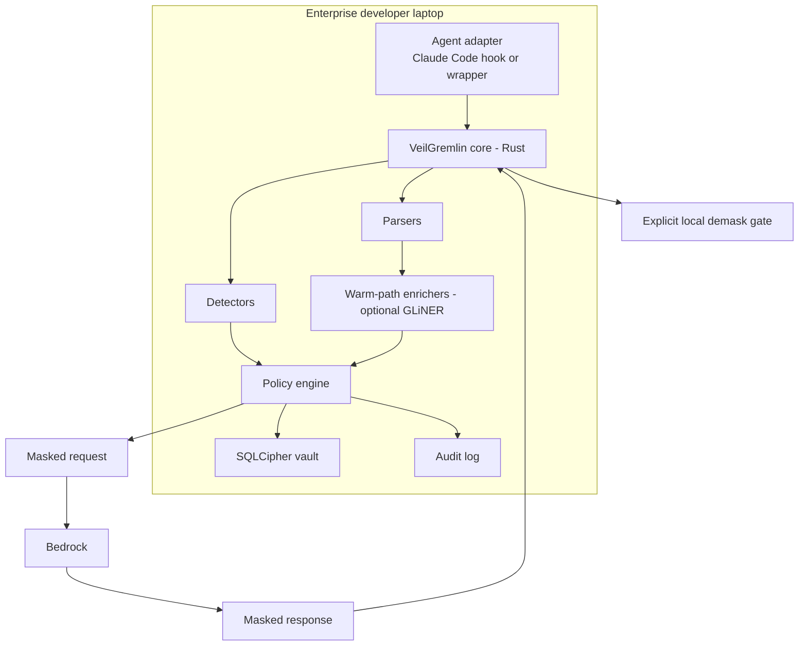

# Architecture: VeilGremlin

VeilGremlin is a **local-first privacy control plane** for agentic coding: a small hardened Rust core that masks real PII and sensitive enterprise identifiers out of model context *before* cloud invocation, with reversible pseudonymisation and explicit local demasking.

This file is the architecture index. The detail lives in:

| Doc | What it covers |
|---|---|
| [`spec/requirements-and-design-spec.md`](spec/requirements-and-design-spec.md) | Full Phase 0/1 requirements & design (the canonical spec, with all Mermaid diagrams) |
| [`architecture/agent-factory-plan.md`](architecture/agent-factory-plan.md) | How **teams of agents** build VeilGremlin — squad topology, waves, gates, contract-first method |
| [`architecture/work-breakdown.md`](architecture/work-breakdown.md) | Task DAG (T01–T11) with owners, dependencies, acceptance |
| [`architecture/interface-contracts.md`](architecture/interface-contracts.md) | Frozen crate seams (traits/types) that enable parallel agent work |
| [`research/deep-research-report.md`](research/deep-research-report.md) | Source research and market/regulatory analysis |
| [`decisions.md`](decisions.md) | ADR log |

## Overview

## Components (crate map)

| Crate | Responsibility | Owner squad |
|---|---|---|
| `vg-core` | shared types, library API, masking pipeline | Squad 0 |
| `vg-detectors` | regex/checksum/entropy/dictionary detectors (hot path) | Squad 1 |
| `vg-parsers` | tree-sitter + format parsers, span model | Squad 2 |
| `vg-vault` | SQLCipher store, keychain wrap, HMAC keying, TTL | Squad 3 |
| `vg-policy` | 3-layer YAML/TOML policy engine | Squad 4 |
| `vg-audit` | append-only structured event log | Squad 5 |
| `vg-cli` / `vg-adapters-claude` | `vg` binary, Claude Code hooks + wrapper | Squad 6 |
| `vg-bench` | benchmark + eval harness, Go/No-Go report | Squad 7 |

## Data Flow

Hot path (deterministic, local, no network/ML): parse → detect → vault intern → policy decision → masked pack. Warm path (off the request path): file-type parsing, optional GLiNER, repo indexes. Cold path (CI/scheduled): leakage scoring, red-team, benchmarks. Full diagrams in the spec.

## Design Decisions

See [decisions.md](decisions.md) for the ADR log (ADR-001…ADR-010).
