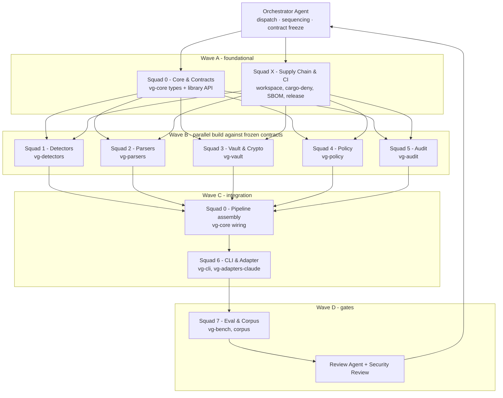

# VeilGremlin — Agent Factory Build Plan

**Audience:** the teams of agents (and the human operator) building VeilGremlin inside the Hekton factory.
**Companion docs:** `work-breakdown.md` (task DAG), `interface-contracts.md` (frozen seams), `../spec/requirements-and-design-spec.md` (what we're building), `../research/deep-research-report.md` (why).

This document defines **how a team of agents builds VeilGremlin**: the squad topology, the contract-first method that unlocks parallelism, the dependency DAG, the per-task definition of done, the git/PR protocol, and the quality gates. It is written so that an orchestrator can dispatch bounded tasks to multiple builder agents at once without them colliding.

---

## 1. Operating model

VeilGremlin is a **factory-output** project. It is built by **Hekton Gremlins** (builder agents) under Hekton rules: human-led, agent-assisted; agents propose/draft/build/review bounded tasks; the human decides depth and approves merges. Every squad obeys the **Hekton Documentation Contract** and **session-scoped commits** (one session → one attributable commit, explicit paths only).

Three invariants govern all build work:

1. **Contract-first.** No squad writes implementation until the interface it depends on is frozen in `interface-contracts.md`. This is what makes parallel agent work safe.
2. **Hot path is sacred.** Any change touching the hot path must ship with a criterion benchmark proving p95 < 25 ms (assembly) and must not introduce network or ML calls. A failing budget blocks merge.
3. **Privacy gates are non-negotiable.** "Zero raw PII to remote" is a test, not a hope. The eval harness asserts it; no merge bypasses it.

---

## 2. Squad topology

Each squad is a **builder agent (or small agent team) that owns one crate / work stream**. Ownership means: writes the code, its tests, its benches, its crate-level docs, and keeps its slice of the contract honest. A squad never edits another squad's crate internals — only its public interface via a contract-change request (§6).

| Squad | Owns (crate/stream) | Primary Hekton role | Key deliverable |
|---|---|---|---|
| **Orchestrator** | dispatch, contract freeze, DAG | (operator + lead agent) | sequencing, merge order, gate enforcement |
| **Squad 0 — Core & Contracts** | `vg-core` | Build Agent (lead) | shared types, library API, masking pipeline wiring |
| **Squad X — Supply Chain & CI** | workspace, CI, release | Build + Release Agent | `Cargo.toml` workspace, `cargo-deny`/`cargo-audit`, SBOM, signing, reproducible build |
| **Squad 1 — Detectors** | `vg-detectors` | Build Agent | regex/checksum/entropy/dictionary detectors + benches |
| **Squad 2 — Parsers** | `vg-parsers` | Build Agent | tree-sitter + format parsers, span model |
| **Squad 3 — Vault & Crypto** | `vg-vault` | Build Agent | SQLCipher store, keychain wrap, HMAC keying, TTL |
| **Squad 4 — Policy** | `vg-policy` | Build Agent | 3-layer YAML/TOML policy engine, signed-pack verify |
| **Squad 5 — Audit** | `vg-audit` | Build Agent | append-only structured event log, redaction-safe |
| **Squad 6 — CLI & Adapter** | `vg-cli`, `vg-adapters-claude` | Build + Integration Agent | `vg` binary, Claude Code hooks + wrapper, Bedrock path |
| **Squad 7 — Eval & Corpus** | `vg-bench`, `corpus/` | Experimentalist + Build Agent | seeded corpus, metrics harness, Go/No-Go report |
| **Review** | cross-cutting | Review Agent, `/security-review` | correctness, privacy, supply-chain review per PR |
| **Docs** | cross-cutting | Documentation + Walkthrough Agent | keep spec/decisions/walkthrough current |

---

## 3. Build waves (sequencing)

The DAG collapses to four waves. Within a wave, squads run **in parallel**. Between waves, the prior wave's contract/artefact must be frozen.

### Wave A — Foundation (serial, blocking)
- **Squad X** scaffolds the Cargo workspace, CI (`cargo-deny`, `cargo-audit`, `fmt`, `clippy`, `--locked`), and the bench/CI skeleton. *(Task T01)*
- **Squad 0** defines and **freezes** the shared types + library API in `vg-core` (`scan`/`mask`/`rehydrate`/`benchmark`, `Finding`, `EntityType`, `HandlingClass`, `Namespace`, `MaskedPack`, `AuditEvent`, and the trait seams for vault/policy/detector/parser/audit). *(Task T02)*
- **Exit:** `interface-contracts.md` v1 is frozen; `cargo build` green on empty crates; CI runs.

### Wave B — Parallel build (5 squads at once)
Each squad builds its crate against the frozen traits, with its own unit tests and (where on the hot path) criterion benches. They depend on Wave A only, not on each other.
- Squad 1 → `vg-detectors` *(T03, T04)*
- Squad 2 → `vg-parsers` *(T08)*
- Squad 3 → `vg-vault` (+ placeholder keying T04 shared with Squad 1 via contract) *(T05)*
- Squad 4 → `vg-policy` *(T06)*
- Squad 5 → `vg-audit` *(T05b)*
- **Exit:** each crate passes its unit tests + benches; trait impls satisfy the contract conformance tests Squad 0 provides.

### Wave C — Integration (Squad 0 then Squad 6)
- **Squad 0** wires the masking pipeline: detectors → policy → vault → masked pack, including `.env`/block and irreversible-redact. *(T07)*
- **Squad 6** builds the `vg` CLI and the Claude Code adapter (hooks + wrapper), the Bedrock masked-request path, pre-send summary, and the explicit `vg demask` gate. *(T09)*
- **Exit:** end-to-end masked round trip works on a fixture; demask gate enforced.

### Wave D — Gate (Squad 7 + Review)
- **Squad 7** stands up the seeded corpus + metrics harness and produces the **Go/No-Go report**. *(T10)*
- **Review Agent** + `/security-review` run on the full diff; privacy and supply-chain criteria checked.
- **Exit:** Go/No-Go thresholds met → human approval → Phase 1 milestone.

---

## 4. Parallelism map (what can run simultaneously)

```mermaid
gantt
    dateFormat  X
    axisFormat  %s
    section Wave A
    T01 workspace+CI (Squad X)      :a1, 0, 1
    T02 contracts (Squad 0)         :a2, 0, 1
    section Wave B (parallel)
    T03/T04 detectors (Squad 1)     :b1, 1, 2
    T08 parsers (Squad 2)           :b2, 1, 2
    T05 vault (Squad 3)             :b3, 1, 2
    T06 policy (Squad 4)            :b4, 1, 2
    T05b audit (Squad 5)            :b5, 1, 2
    section Wave C
    T07 pipeline wiring (Squad 0)   :c1, 2, 3
    T09 cli+adapter (Squad 6)       :c2, 3, 4
    section Wave D
    T10 eval+corpus (Squad 7)       :d1, 4, 5
    Review + security review        :d2, 5, 6
```

**Rule of thumb for the orchestrator:** dispatch all of Wave B in one batch once T01+T02 merge. Do not let a Wave B squad start before the contract is frozen — a contract change after parallel work starts forces rework across five crates.

---

## 5. Definition of Done (per task)

A task is Done only when **all** hold:

- [ ] Code compiles under `cargo build --locked`; `cargo clippy -- -D warnings` clean; `cargo fmt --check` clean.
- [ ] Unit tests cover the happy path + at least the failure modes named in the spec for that component.
- [ ] If it touches the **hot path**: a criterion bench exists and p95 is within budget (< 25 ms assembly); no network/ML added.
- [ ] If it touches **privacy behaviour**: a test asserts the relevant Go/No-Go invariant (e.g. no raw value in masked pack; irreversible class never vault-stored).
- [ ] Public interface matches `interface-contracts.md`; any change went through the contract-change protocol (§6).
- [ ] Crate-level docs / rustdoc updated; user-facing change reflected in `../spec/` or CLI help.
- [ ] `docs/decisions.md` updated if a material design decision was made (ADR row).
- [ ] `docs/session-log.md` appended; `docs/next-actions.md` reconciled.
- [ ] **Session-scoped commit**: only this task's files staged by explicit path; one attributable commit; PR opened, human approves merge.

---

## 6. Contract-change protocol

Interfaces in `interface-contracts.md` are **frozen** at the end of Wave A. After that, a squad that needs to change a shared type/trait must:

1. Open a **contract-change request** (a short note in the PR description + a diff to `interface-contracts.md`).
2. Tag the **Orchestrator** and **Squad 0** (contract owner) for review.
3. Land the contract change **first** (its own PR), bump the contract version, and notify downstream squads.
4. Only then implement against the new contract.

This prevents the classic multi-agent failure where two squads silently diverge on a shared struct.

---

## 7. Git & PR workflow (Hekton multi-agent)

- **One branch per task**, named `feat/<squad>-<task-id>-<slug>` (e.g. `feat/detectors-T03-regex-core`).
- **Session-scoped commits.** Stage explicit paths for the files this session created/changed. Never `git add -A` across a tree you didn't fully create. If the tree is dirty from another squad, list those files as "not mine" and leave them.
- **One session → one attributable commit** (squash trivial WIP locally before PR if needed).
- **PR per task**, body: what/why/decisions/assumptions/risks/next-actions + validation status (clippy/fmt/tests/bench). Link the task ID.
- **Human approves merge.** No agent merges without explicit human approval or a written pre-approval rule. Close each session by: opening a PR, merging an approved PR, intentionally skipping with a reason, or leaving the branch open (blocked/stacked).
- **Merge order follows the wave DAG.** Orchestrator enforces it.

End-session: run `scripts/log-session.sh` if present, produce the session summary, update the vault `session-log.md` only via the sync path (boundary rule: repo is source of truth; vault gets card + session-log).

---

## 8. Quality gates (map to Go/No-Go)

| Gate | Owner | Enforced where | Threshold |
|---|---|---|---|
| Build/lint | Squad X CI | every PR | clippy/fmt clean, `--locked` |
| Supply chain | Squad X | every PR | `cargo-deny`/`cargo-audit` pass; SBOM on release |
| Hot-path latency | Squad 1/0 | bench in CI | p95 < 25 ms assembly; e2e p95 < 50 ms |
| Zero raw PII to remote | Squad 7 | eval harness | zero tolerated |
| Placeholder consistency | Squad 0/3 | eval harness | ≥ 99% |
| Secret recall | Squad 1/7 | eval harness | ≥ 99% core classes |
| PII recall | Squad 1/7 | eval harness | ≥ 95% core classes |
| False-positive rate | Squad 7 | eval harness | < 3% reviewed |
| Security review | Review Agent | pre-milestone | `/security-review` pass |

A red gate blocks the milestone, not just the PR.

---

## 9. Coordination artefacts

- **`interface-contracts.md`** — the single source of truth for cross-crate seams. Frozen end of Wave A; versioned.
- **`work-breakdown.md`** — task DAG with IDs (T01…), owners, dependencies, acceptance.
- **`.hekton/agent-run-log.yaml`** — append each agent run (who/what/when) for traceability.
- **`docs/decisions.md`** — ADR log; material decisions only.
- **`docs/session-log.md`** — append-only session history (mirrors to vault).
- **Status board (optional):** a `docs/architecture/build-status.md` the orchestrator updates per wave; or use Hekton TaskList.

---

## 10. Risks specific to the agent build (and mitigations)

| Risk | Mitigation |
|---|---|
| Two squads diverge on a shared type | Contract-first freeze + contract-change protocol (§6) |
| A squad "helpfully" refactors another crate | Ownership rule: edit only your crate; cross-crate via contract request |
| Hot-path regression slips in | Bench gate in CI; Squad 1/0 own the budget |
| Privacy invariant quietly weakened | Eval harness asserts Go/No-Go; Review Agent + security review pre-merge |
| Commits sweep in unrelated dirty files | Session-scoped commits, explicit paths only |
| Contract churn after Wave B starts | Orchestrator freezes contract; changes are rare, reviewed, versioned |
| Supply-chain dep added without review | `cargo-deny` allowlist; dependency review on every bump |

---

## 11. First dispatch (what the orchestrator sends first)

1. **Squad X →** T01 (workspace + CI + supply-chain skeleton).
2. **Squad 0 →** T02 (freeze contracts + shared types). *Runs alongside T01.*
3. On merge of T01 + T02 → **batch-dispatch Wave B** (Squads 1–5: T03/T04, T08, T05, T06, T05b) in parallel.
4. Then T07 (Squad 0 pipeline) → T09 (Squad 6 CLI/adapter) → T10 (Squad 7 eval) → Review.

See `work-breakdown.md` for the full task list and acceptance criteria.
