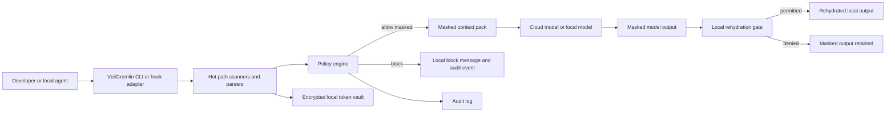
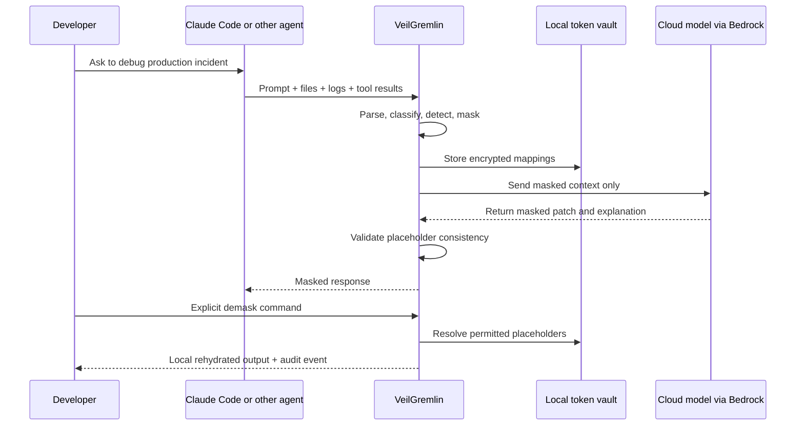
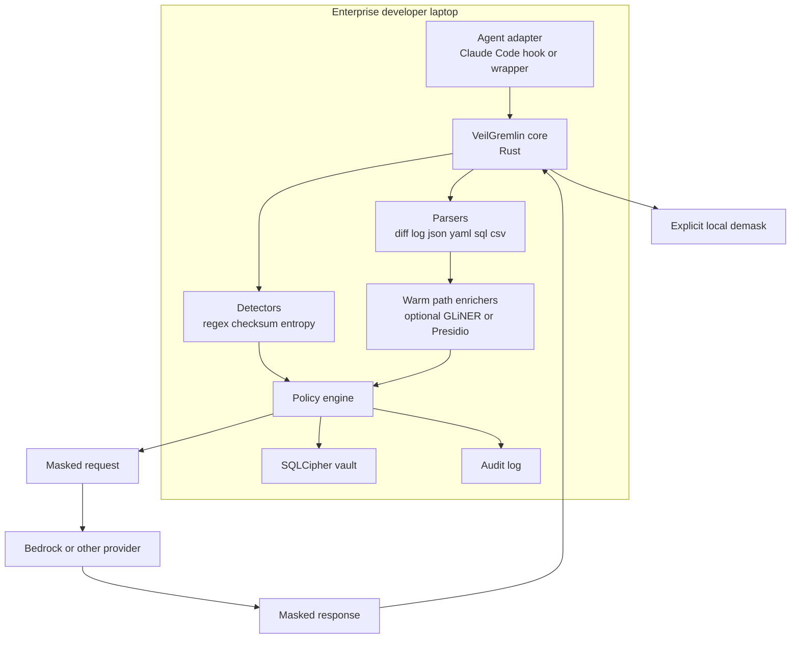
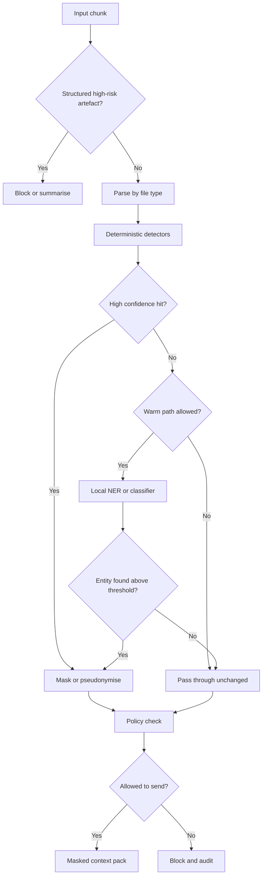
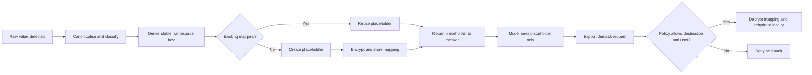
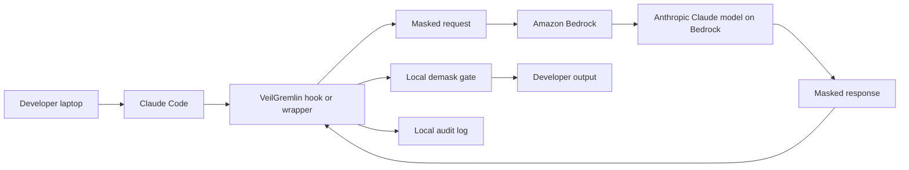

# VeilGremlin: Privacy Shield for Agentic Engineering

## Executive Summary

VeilGremlin should be built as a **local-first privacy control plane for agentic coding**, starting on regulated enterprise developer laptops and enforcing one hard rule: **unless the target model is an approved local model in an approved local runtime, the model must never receive real PII or sensitive enterprise identifiers**. The first release should therefore sit **before** cloud model invocation, intercept developer- and agent-supplied context, apply deterministic masking and reversible pseudonymisation locally, send only masked context to the model, and then perform **explicit, local, policy-gated rehydration** after the response returns. That design aligns far better with GDPR and UK GDPR principles of data minimisation, privacy by design and by default, and security of processing than a model of “send first, detect later”. It also gives privacy, risk, security, and architecture teams something concrete to assess: a technical control that changes what leaves the endpoint, not just what happens after data has already reached a provider. citeturn0search0turn7search8turn7search14turn8search3turn35view1

The timing is good. Coding agents now routinely read local files, inspect repositories, run commands, include terminal output, search indexed codebases, attach screenshots, consume MCP resources, and—at the cloud-hosted end of the market—operate asynchronously in remote sandboxes that can research repos, create plans, edit branches, and open pull requests. Continue can pass `@File`, `@Code`, `@Git Diff`, `@Terminal`, and debugger state into model context; Cline can read and write files and run commands; Codex CLI can inspect repositories, attach screenshots, use MCP, launch cloud tasks, and run commands; Claude Code hooks can intercept user prompts and every tool call inside the agentic loop; Cursor indexes codebases for search and AI context; GitHub Copilot cloud agent works in a GitHub Actions-powered environment and can research a repository, create a plan, make changes on a branch, and optionally open a PR. In other words, sensitive material can leak into model context through far more than just the “chat box”. citeturn34view0turn34view1turn34view3turn19search0turn19search2turn18search0turn33view3

VeilGremlin’s differentiator should not be “another guardrail” or “another DLP scanner”. Bedrock Guardrails, Azure AI Content Safety, Azure PII filters, Google Model Armor, Google Sensitive Data Protection, Macie, and classical DLP platforms all provide useful controls, but they are not designed to be the **millisecond-sensitive, file-aware, developer-friendly, reversible pseudonymisation layer** that sits in the hot path of every coding-agent turn. Secret scanners such as Gitleaks, TruffleHog, and GitHub push protection are excellent for credentials, yet they do not solve general PII handling or context-preserving masking across logs, tickets, stack traces, diffs, terminal output, and agent loops. Presidio, spaCy, GLiNER, and Comprehend PII provide useful building blocks, but they are libraries and services rather than a finished privacy control for agentic engineering. citeturn29search5turn12search0turn12search19turn13search0turn32view0turn32view2turn37view1turn37view0turn17view1turn38search5turn38search10turn30search3turn30search0

The recommended Phase One architecture is therefore opinionated. Build a **Rust core engine** with a **deterministic hot path**, a **local encrypted token vault**, **typed placeholders rather than synthetic values**, and **Claude Code on Bedrock** as the first reference workflow. Integrate first as a **wrapper plus hook-based interceptor**, not as a central gateway, because the initial value proof has to run on developer laptops without waiting for a control plane rollout. Add a warm path for optional local NER, parser-based enrichment, and precomputed repo indexes. Keep demasking **explicit and local**, never automatic back into a cloud prompt. Then, in Phase Two and beyond, expose the same hardened core through LiteLLM gateway hooks, MCP adapters, CI/CD modes, and sanitised cloud-agent workflows. That gives coderturtle and The Agentic Tekton a plausible public open-source project, a credible enterprise reference architecture, and a narrative that supports privacy-by-design adoption without overclaiming compliance. citeturn20search15turn20search11turn36search0turn36search6turn19search1turn19search4turn35view3

### Why This Matters Now

Regulated organisations increasingly want the productivity gains of “vibe coding” and agentic engineering, but privacy and risk teams are right to worry. Current tools can pull in much richer context than ordinary chat interfaces: local files, repository maps, diffs, terminal output, screenshots, MCP resources, and remote issue/PR workflows. Observability platforms add a second risk layer because they often capture traces of model calls, tool executions, retrieval steps, prompts, outputs, and custom logs. Langfuse markets prompt and trace visibility; Helicone logs requests in real time unless explicitly omitted; Phoenix traces model calls, tool use, retrieval, and custom logic. Without a privacy shield, enterprises risk leaking sensitive data not only to model providers, but also to gateways, traces, logs, audit sinks, and cloud-hosted agent sandboxes. citeturn34view0turn34view1turn34view3turn11search4turn11search5turn22search8turn22search12turn22search5turn22search1turn22search2

### Problem Statement

The core problem is not simply “detect PII somewhere in the SDLC”. It is to **constrain what enters model-visible context** while preserving enough semantic structure for models to remain useful on engineering tasks. That means stabilising references across a session, preserving entity relationships, maintaining patch usability, keeping latency very low, supporting forensic audit, and preventing local demasking from ever re-exposing real values to remote models. The product thesis is therefore narrower and sharper than generic DLP: VeilGremlin is a **privacy-preserving context transformation engine for agentic software delivery workflows**. citeturn8search14turn8search3turn27search2turn35view1

### Design Principles

The design should follow a small set of hard principles. **Minimise before transmission.** **Mask automatically; demask explicitly.** **Keep the hot path deterministic.** **Prefer typed placeholders over “smart” semantic substitutions in Phase One.** **Use policy-as-code for explainability and exception handling.** **Separate model-visible context from rehydration material.** **Default to local execution and no telemetry.** **Treat supply chain integrity as part of the privacy control, not an afterthought.** These principles fit GDPR Article 5 data minimisation, Article 25 data protection by design and by default, Article 32 security of processing, the ICO’s DPIA expectations, and NIST’s privacy engineering objectives of predictability, manageability, and disassociability. citeturn0search0turn7search14turn7search8turn8search3turn27search2

### Personas

The **developer** wants fast, low-friction help without exposing real customer or employee data. The **platform engineer** wants a deployable control that works with existing agents and later with gateways. The **privacy officer** wants minimisation, reversible pseudonymisation controls, and DPIA evidence. The **risk manager** wants clear boundaries, exception handling, and measurable residual risk. The **security engineer** wants tight local controls, strong key handling, and minimal exfiltration paths. The **AI governance lead** wants auditable policies, logs, and deployment narratives. The **enterprise architect** wants something that starts on laptops but scales cleanly to gateways, CI/CD, and cloud agents. Those expectations map well to the governance emphasis in the NIST AI RMF and to the EU AI Act’s focus on technical documentation, logging, risk management, and human oversight for applicable systems. citeturn35view1turn35view2turn5search7turn5search10

### Use Cases

Phase One should focus on the highest-value, easiest-to-demonstrate path: **a developer debugging a production incident log with Claude Code on Bedrock**. The same design then extends to repo analysis, PR review, issue triage, migration work, incident analysis, CI/CD agent runs, and local IDE agent workflows. In later phases it should also support cloud-hosted coding agents by creating **sanitised task bundles**, **sanitised repo mirrors**, and **privacy-safe worktrees** so that the remote runtime never receives production PII in the first place. GitHub’s documentation for Copilot cloud agent is especially instructive here: the agent can carry chat context, work autonomously in a GitHub Actions-powered environment, research the repository, change a branch, and open a PR. VeilGremlin’s cloud-agent answer must therefore start **before the sandbox is provisioned**, not only at model invocation time. citeturn33view3turn34view3turn34view0

### Non-goals

Phase One should **not** try to become a full enterprise DLP platform, a universal secret manager, a regulator-facing compliance guarantee, or a semantic safety framework for all harmful content categories. It should also **not** depend on cloud LLMs to decide whether data is safe to send to cloud LLMs. Guardrails and DLP services remain complementary layers, but VeilGremlin’s job is narrower: **privacy-safe context transformation for agentic engineering**. citeturn29search5turn12search0turn13search0turn32view2

## Regulatory and Risk Context

This section is not legal advice. It translates regulatory and supervisory expectations into technical and organisational controls.

Under GDPR and UK GDPR, the most relevant anchors are straightforward. Data minimisation requires personal data to be adequate, relevant, and limited to what is necessary. Data protection by design and by default requires appropriate technical and organisational measures. Security of processing explicitly names pseudonymisation and encryption as suitable measures. A DPIA is required where new technologies are likely to result in high risk to individuals, and the ICO stresses that a DPIA should begin early and run alongside planning and development. For VeilGremlin, that translates into endpoint-side minimisation, policy-driven masking, separate storage of mapping material, strict access control to rehydration, and evidence artefacts that show what left the device, what was blocked, what was transformed, and why. citeturn0search0turn7search14turn7search8turn8search14turn27search2

Just as important, both the ICO and the EU data protection guidance make clear that **pseudonymised data remains personal data**, while anonymisation is only effective when re-identification risk is sufficiently remote. The ICO emphasises the broad concept of identifiability and warns that people can be identifiable through many factors, not just names. The Article 29 Working Party’s anonymisation opinion warns about residual identification risk when datasets are combined, and the EDPB’s 2025 pseudonymisation guidance reiterates that effective pseudonymisation depends on separate handling of additional information and strong organisational and technical controls. For VeilGremlin that means typed placeholders and vault mappings are a **risk reduction measure**, not a claim that the transformed text is automatically anonymous. It also means the product needs a future roadmap for quasi-identifier analysis and contextual leakage scoring. citeturn8search3turn8search7turn8search0turn8search14turn32view3

The EU AI Act matters less because VeilGremlin itself is not “the compliance answer”, and many coding assistants will not fall into high-risk categories. Even so, the Act is highly relevant as a governance benchmark. The European Commission describes it as a risk-based framework for developers and deployers, and the AI Act service materials emphasise risk management, logging, technical documentation, instructions for use, and human oversight for applicable systems. Enterprises are already borrowing those expectations for lower-risk internal deployments because they offer a practical governance vocabulary: document the system, define roles, log relevant events, preserve human review for sensitive decisions, and maintain evidence of controls. VeilGremlin should therefore be positioned as a **supporting technical and governance control** that helps enterprises implement minimisation, logging, oversight, and documentation—not as something that “makes you compliant”. citeturn35view2turn5search7turn5search10turn3search0

Provider data-handling differences strengthen the case for a provider-independent privacy layer. Bedrock states that customer content is not used to improve base models and not shared with model providers; Anthropic offers Zero Data Retention for eligible APIs and specifically covers Claude Code when used with commercial organisation API keys or Claude Enterprise; OpenAI’s business products and API are opt-out of training by default, but OpenAI also documents default abuse-monitoring logs and application state for some API features, and consumer Codex/ChatGPT services may use content for training unless opted out; Azure states that prompts and completions are not available to OpenAI or other model providers and are not used to train foundation models without permission, yet optional stateful features such as Responses API, Threads, and Stored completions can persist message history and other content. The lesson is not that one provider is necessarily unsafe; it is that **retention and statefulness vary by provider, endpoint, and feature**, so the safest enterprise default is still to minimise what leaves the endpoint in the first place. citeturn33view1turn33view2turn32view3turn31view0turn32view1turn33view0

Financial-services and wider regulated-enterprise expectations are also consistent with this design. NIST’s AI RMF is explicit that AI risks need to be governed across the lifecycle, and NIST’s privacy engineering guidance frames privacy as a system property shaped by predictability, manageability, and disassociability. The NCSC, CISA, NSA, and partner secure AI guidance also warns that prompt injection and related AML attacks can enable unauthorised actions or extraction of sensitive information, while the NCSC has separately argued that prompt injection can be difficult to mitigate and that systems should therefore be designed to limit the consequences of compromised outputs. In practice, that translates to layered controls, clearly bounded trust, sanitised context, and human review for sensitive rehydration or downstream actions. citeturn35view1turn27search2turn14search2turn14search10turn14search18

### Regulatory Control Mapping

VeilGremlin’s control mapping is intentionally practical.

**Data minimisation and privacy by default** map to pre-invocation masking, repo risk profiles, deny-by-default treatment of known sensitive artefacts such as `.env` files and production data extracts, and context-pack generation that includes only the minimum masked excerpts needed for the task. citeturn0search0turn7search14

**Security of processing** maps to local execution, encrypted vault storage, separation of mapping keys from transformed context, audit logging, signed policy packs, and controlled demasking. citeturn27search2turn24search0turn24search7

**DPIA evidence** maps to data-flow diagrams, policy files, transformation logs, benchmark results, detector coverage reports, exception approvals, and demo packs showing that cloud models never received raw PII in the tested scenarios. citeturn7search14turn7search18

**Human oversight and risk management** map to explicit demask commands, break-glass flows, approval gates for high-sensitivity rehydration, and role-based controls in enterprise mode. citeturn5search7turn5search10turn35view1

**Technical documentation and logging** map to deterministic rulesets, structured event logs, signed releases, auditable build provenance, and system diagrams. citeturn35view2turn24search0turn24search6

## Current Tooling Landscape

### Problem Validation

Modern coding agents do not just send a user prompt. They assemble context from many places, often iteratively. Continue exposes built-in context providers for files, code symbols, git diffs, terminal output, open files, clipboard content, workspace trees, problems, debugger state, and MCP resources. Cline reads and writes files, runs terminal commands, browses the web, and supports headless CI/CD automation. Aider requires files to be added to chat, can automatically pull related files, can read documentation snippets and filesystem files, and auto-commits changes into Git. Codex CLI reads, changes, and runs code locally, supports screenshots, MCP access, web search, and Codex Cloud tasks. Claude Code hooks fire on session events, user prompts, and every tool call in the agentic loop, which means context can grow through iterative tooling rather than a single one-shot prompt. Cursor explicitly indexes the codebase for search and AI context. citeturn34view0turn34view1turn16search2turn16search14turn16search3turn34view3turn19search0turn18search0

That creates many leakage paths. The obvious ones are customer names, emails, phone numbers, account numbers, postcodes, employee IDs, and support-ticket text. Less obvious but equally material are stack traces with internal hostnames and usernames, JSON logs with embedded identifiers, screenshots containing chat transcripts or dashboards, `.env` files, credentials in code comments, pasted CSVs, query results, MCP resources backed by databases, and issue text that includes personal details. There is also a second-order leakage path through traces and gateways: Langfuse logs traces and prompts; Helicone logs requests and responses unless omission headers are used; Phoenix captures model calls, tool use, retrieval, and custom logic. If those systems are deployed without privacy-aware transformation, they can replicate the leakage VeilGremlin is trying to prevent. citeturn11search5turn34view0turn22search8turn22search1turn22search2

### Existing Market and Open-Source Landscape

**Cloud guardrails and safety controls** are valuable, but they are not a complete answer for this use case. Bedrock Guardrails can detect harmful content, prompt attacks, and sensitive information in prompts or model responses; Azure offers Prompt Shields, content safety, and PII filtering; Google Model Armor screens prompts and responses and Google Sensitive Data Protection offers classification and de-identification. These services are useful for layered protection, especially for harmful-content controls and enterprise runtime safety, but they remain remote services with their own pricing, throughput limits, and feature boundaries. Bedrock’s `ApplyGuardrail` is a separate API, guardrail pricing is based on text units, and Bedrock documents that sensitive-information filters do not detect PII in tool-use output parameters. That combination makes them good complements, but poor candidates for the only hot-path privacy barrier in an agentic coding loop. citeturn29search5turn29search1turn29search2turn29search11turn29search14turn12search0turn12search19turn13search0turn32view0

**Enterprise DLP and data discovery tools** are also useful, but they solve adjacent problems. Macie is excellent for sensitive-data discovery in S3, including managed and custom identifiers with allow lists. Google Sensitive Data Protection offers broad inspection and de-identification pipelines, and can be used on or off Google Cloud. Microsoft’s enterprise privacy stack similarly supports content safety and filtering. Yet these products are optimised for data estates, storage systems, and service boundaries, not for ultra-fast local interception of every agent turn on a laptop. VeilGremlin should integrate with them later for discovery and assurance, but should not try to depend on them in the hot path. citeturn32view2turn32view0turn12search19turn12search7

**Secret scanners** are necessary but insufficient. GitHub push protection blocks secrets before they reach repositories and can record bypasses to audit logs. Gitleaks scans repos, files, and stdin for secrets and supports pre-commit integration. TruffleHog goes further by looking across Git, chats, wikis, logs, object stores, filesystems, and more, and can validate whether a detected secret is live. VeilGremlin should borrow from this ecosystem for credentials and entropy-based findings, but secret scanning is only one slice of the problem: names, addresses, account identifiers, HR references, incident notes, and quasi-identifying log combinations are not solved by secret scanners alone. citeturn17view1turn37view1turn37view0

**PII detection libraries and services** provide the best raw ingredients. Presidio provides fast identification and anonymisation modules and is deliberately designed as a customizable library rather than a fixed service. spaCy is fast and production-oriented, but its transition-based NER works best for “traditional” named entities, assumes decisive signals near initial tokens, and is not a perfect fit for every span-identification problem. GLiNER is attractive because it is lightweight, supports zero-shot entity extraction, and is optimised for CPUs and consumer hardware. Amazon Comprehend PII gives structured results and redaction, but its PII support is limited to English and Spanish. The practical conclusion is that a **hybrid, local pipeline** wins: deterministic rules in the hot path, with lightweight NER used selectively in warm-path preparation and higher-risk contexts. citeturn38search5turn38search9turn38search10turn38search0turn30search3turn30search0turn30search8

**Observability and prompt-firewall products** are valuable for runtime visibility, but they can also enlarge the blast radius if prompt data is collected unsafely. Langfuse, Helicone, Phoenix, Lakera, and similar tools help teams trace, evaluate, and protect LLM applications. VeilGremlin should therefore treat them as downstream integrations that must receive only masked context or heavily redacted metadata. In enterprise mode, prompts should either be omitted from those sinks or replaced with placeholder-preserving variants. citeturn22search8turn22search1turn22search2turn22search7turn22search15

**Middleware and policy engines** matter because some teams will want first-class agent-framework integrations. LangChain supports middleware for transforming prompts, tool selection, logging, and guardrails; Semantic Kernel provides prompt-render and function-invocation filters; OPA provides a mature general-purpose policy engine; Cedar is a policy language and engine for authorisation decisions with a strong Rust fit. VeilGremlin should not start inside any one of these ecosystems, but it should expose adapters to them later. The cleanest long-term pattern is a **small hardened core** with optional framework bridges. citeturn9search0turn9search4turn9search5turn9search2turn9search3turn10search0turn10search12

### Build-vs-buy Analysis

The market review supports a “**build the core, integrate the edges**” conclusion. Enterprises can buy guardrails, DLP, observability, key management, and gateway components. They cannot readily buy a single tool that does all of the following at once: millisecond-sensitive endpoint interception, file-aware masking, stable reversible pseudonymisation, placeholder consistency across an agent session, local-only demasking, developer-friendly CLI workflows, and later gateway/cloud-agent extension. LiteLLM is particularly relevant as a future gateway because it already provides an OpenAI-compatible proxy and supports pre-call hooks and callbacks. But VeilGremlin should sit **alongside** LiteLLM as a low-dependency engine, not be absorbed into a large Python gateway codebase in Phase One. citeturn36search0turn36search1turn36search6turn36search19

## Threat Model and Data Flow

### Threat Model

The system has four main threat classes.

The first is **accidental disclosure**: a developer pastes logs, stack traces, CSV rows, ticket text, or config fragments that include real PII. This is the most likely and most commercially important case. Continue, Cline, Aider, Codex, Claude Code, and similar tools all make this easy because they are designed to pull context from a running engineering environment. citeturn34view0turn34view1turn16search2turn34view3turn19search0

The second is **agentic amplification**: even when the user prompt is harmless, the agent may retrieve additional material through terminal commands, repo maps, diffs, MCP resources, or cloud-agent repository research. Because Claude Code hooks and LangChain-style middleware exist at tool-call boundaries, VeilGremlin can exploit those same seams to inspect and transform context before it reaches the model. citeturn19search0turn19search2turn9search4turn9search5

The third is **adversarial manipulation**, especially prompt injection and indirect document attacks. Azure Prompt Shields explicitly targets prompt attacks in user inputs and documents. Bedrock documents prompt-attack filters. The NCSC and allied security guidance warn that prompt injection can lead to unauthorised actions or sensitive-data extraction and may be fundamentally hard to eliminate, which means the surrounding system must be designed to reduce consequences. For VeilGremlin that means never trusting model requests for raw values, never allowing remote models to “ask for the real data back”, and giving rehydration its own independent policy gate. citeturn12search0turn12search4turn12search6turn14search10turn14search18

The fourth is **supply-chain and control-plane compromise**. If the privacy engine itself leaks data through telemetry, malicious dependencies, unsigned plugins, tampered binaries, or compromised update channels, the control is worse than useless. Supply-chain integrity therefore belongs inside the threat model: signed binaries, reproducible builds, SBOMs, provenance, offline install options, and policy-pack signing are not “nice to have”; they are trust prerequisites for the product. citeturn24search0turn24search6turn24search7turn14search2

### Data Flow and Context Map



The critical design choice is that the **vault and the original values never travel with the prompt**. The cloud model sees placeholders, not secrets; the local runtime sees mappings; the audit layer sees structured events; and demasking happens only after a separate policy check. This implements a clean separation between **model-visible context**, **control material**, and **user-visible rehydration**. citeturn8search14turn27search2turn35view1



### Sensitive Data Taxonomy

VeilGremlin should maintain two overlapping taxonomies: a **privacy taxonomy** and an **enterprise sensitivity taxonomy**.

The privacy taxonomy should cover direct identifiers such as names, emails, phone numbers, addresses, postcodes, employee IDs, customer IDs, national identifiers, payment identifiers, and account references; indirect identifiers such as timestamps, job titles, incident references, unusual locations, and rare combinations; and special treatment objects such as free-text support tickets and customer-impact notes. This follows the ICO’s broad notion of identifiability and the EDPB/WP29 emphasis on residual re-identification risk. citeturn8search3turn8search0turn8search14

The enterprise sensitivity taxonomy should cover secrets and credentials, internal hostnames, internal IPs, infrastructure identifiers, ticket numbers, trace IDs, repo-specific IDs, confidential architecture details, and business-sensitive labels. These are not all “personal data”, but they matter because they can increase inference risk, enable attacks, or create unacceptable confidentiality exposure when combined with personal data. The secret-scanning ecosystem and cloud DLP products already reflect this broader sensitivity model. citeturn37view1turn37view0turn32view2turn32view0

### Context Interception Points

For local agents, interception should occur at five points: **user-prompt submission**, **file attachment or context-provider expansion**, **pre-tool invocation**, **post-tool output ingestion**, and **pre-model request assembly**. Claude Code hooks are especially attractive because they can trigger on `UserPromptSubmit`, `PreToolUse`, and `PostToolUse`, while Continue-style context providers and Codex/MCP integrations show where file and tool context enter the workflow. citeturn19search0turn19search1turn19search4turn34view0turn34view3

For cloud-hosted agents, the interception point has to move earlier: **before the repo or task bundle is packaged for the cloud runtime**. That is why Phase Three should add sanitised repo mirrors, sanitised task bundles, and PR rehydration workflows. If the cloud agent already has the raw repo, log bundle, and issue export, a later prompt-only control is too late. citeturn33view3turn36search0

### Failure Modes

The main failure modes are predictable. False negatives leak raw values. False positives degrade utility and developer trust. Placeholder instability breaks reasoning across turns. Over-redaction destroys the task. Under-redaction leaks quasi-identifiers. Demasking to the wrong destination re-exposes cloud models. Vault corruption breaks reversibility. Prompt-injection attempts can request the original values. Observability integrations can capture raw inputs if placed before VeilGremlin. Supply-chain compromise can exfiltrate mappings. The architecture must therefore optimise not for “perfect detection”, but for **bounded failure**, clear logs, and conservative handling of high-risk artefacts such as `.env` files, raw database extracts, and production log bundles. citeturn14search18turn22search1turn22search2turn24search0

## Recommended Architecture

### Architecture Options

There are four plausible anchor patterns.

A **provider-side guardrail-first design** is easy to describe but fundamentally weak for the hard rule in this brief, because the provider or gateway still receives the raw content to inspect. That helps with moderation and runtime safety, but it does not satisfy “the model must never see real PII” as a default operating principle. citeturn29search5turn12search0turn13search0

A **pure regex/rule engine** is fast and explainable, and it should dominate the hot path. It is mandatory for structured identifiers, secrets, checksummed numbers, and explicit deny-listed values. But it will miss many context-sensitive cases such as names in ticket prose or unique phrases in incident reports. Secret scanners themselves illustrate both the power and the limits of regex-heavy approaches. citeturn37view1turn37view0

A **pure ML/NER design** is more flexible, but it adds latency, broader dependency chains, more difficult explainability, and more variable boundary quality. spaCy’s own documentation warns about the assumptions embedded in its NER component, while Comprehend PII has language limits and Presidio is a toolkit rather than a whole system. A CPU-friendly model such as GLiNER is attractive for warm-path enrichment, but not as the only gate on every request. citeturn38search0turn38search6turn30search0turn30search3turn38search5

A **hybrid local engine** is therefore the practical answer: deterministic hot path, parser-aware enrichment, optional local NER in the warm path, strict policy evaluation, and reversible pseudonymisation. That is the recommended architecture. citeturn38search5turn30search3turn23search0turn23search2

### Recommended Architecture

The best Phase One shape is:

- **Rust core engine**
- **Thin adapters** for Claude Code hooks and CLI wrapping
- **Deterministic hot-path scanners** for prompts, diffs, tool outputs, and attached content
- **File-aware parsers** for common engineering artefacts
- **Encrypted local token vault** backed by SQLCipher
- **Explicit demask command**
- **Native policy file** with later Cedar-style enterprise authorisation support
- **No telemetry by default**
- **Audit log and benchmark harness built in**

Rust is the right recommendation because the official language materials emphasise memory safety, thread safety, no garbage collector, and suitability for performance-critical services and cross-language integration. That combination fits a privacy/security control with strict enterprise review needs far better than a Python- or Node-only core, while still allowing Python or Node adapters around the edges where agent ecosystems expect them. Codex CLI itself is a telling market signal here: OpenAI documents it as built in Rust “for speed and efficiency”. citeturn20search15turn20search11turn34view3



### Detection and Masking Pipeline

The hybrid pipeline should be explicit and easy to explain.

**Fast pre-scan.** Detect obvious blockers and fast wins: `.env` files, PEM headers, JWT-like strings, high-entropy secrets, account number prefixes, email shapes, IPv4/IPv6, phone variants, IBAN/SWIFT, sort-code patterns, and common HR/customer ID formats. Use RE2/Hyperscan-style bounded matching concepts, tries, and Aho-Corasick where helpful, with checksum validation for structured identifiers. This is the hot path. citeturn37view1turn37view0turn30search8

**File-type-aware parsing.** Parse content before scanning it. Tree-sitter is especially well suited for source-code and diff-aware parsing because it is incremental, fast enough for near-live updates, robust in the face of syntax errors, and dependency-free at runtime. That makes it attractive for a local privacy engine. Similar specialist parsers should be used for JSON, YAML, TOML, SQL, CSV, Markdown, and log formats. citeturn23search0turn28view0

**Deterministic detection.** Run custom regex, deny lists, organisation dictionaries, checksum validators, secret detectors, allow lists, and proximity rules. Presidio’s deny-list and regex recogniser ideas are useful inspiration even if the core engine is written in Rust. citeturn38search5turn38search19turn38search7

**Selective ML/NER.** Only after the deterministic pass, and only when policy allows, run a lightweight local model on natural-language-heavy content such as tickets, incident reports, support text, or unstructured logs. GLiNER is the best Phase One warm-path candidate for this because it is lightweight, CPU-friendly, and supports zero-shot entity extraction. spaCy remains useful for certain pipelines, but it should not be the primary answer for every entity class or every context. citeturn30search3turn38search10turn38search0

**Policy decision.** Decide whether to allow masked transmission, generalise further, replace with a summary, or block entirely. For example, `.env` files should usually be blocked, not masked. A stack trace with usernames and internal IPs should be masked and allowed. A raw support CSV with dozens of real customer records may be block-or-summarise only. Cloud guardrail services can be configured as optional secondary controls after VeilGremlin transforms content, not before. citeturn29search5turn29search4turn12search0turn13search0

**Context-pack generation.** Assemble a prompt package that preserves line numbers, file names where safe, entity relationships, and placeholder consistency, while omitting raw values and unnecessary surrounding material.

**Rehydration.** Validate that the model preserved placeholders, then allow user-requested local demasking only for permitted destinations.

A compact policy decision flow looks like this:



### Code-Aware and File-Aware Masking

The masking strategy should vary by artefact.

For **source code**, prioritise comments, string literals, fixtures, test data, and embedded configuration. Avoid corrupting syntax. For example, replace only string contents where possible, not variable names or control flow, unless a secret or identifier is literally encoded in a name. Tree-sitter-style parsing is a strong fit here because it lets the engine distinguish syntax nodes. citeturn23search0turn28view0

For **JSON, YAML, TOML, Kubernetes manifests, Terraform, and CloudFormation**, treat keys as strong signals. A field named `email`, `phone`, `customer_name`, `ssn`, `employee_id`, `apiKey`, or `authorization` deserves different handling from a random string under `title`. Structured config should use rule packs heavily.

For **logs and stack traces**, parse key-value structure, JSON fragments, timestamp patterns, internal IPs, usernames, hostnames, file paths, trace IDs, and exception messages. Mask identifiers but preserve shape and causality, because debugging depends on sequence and correlation more than on raw identity.

For **SQL, CSV, and parquet-derived text snippets**, prefer column-aware masking. If a developer pastes a query result, the engine should infer sensitivity from headers and data types. Multiple-row extracts above a configurable threshold should default to block or summary.

For **tickets, issues, markdown, runbooks, and incident reports**, use the hybrid path: deterministic patterns first, then selective local NER for names, addresses, job titles, and related free text.

For **`.env` files and secret-bearing files**, do not be clever. Block by default, with a sanctioned command to generate a synthetic or summarised representation instead.

### Token Vault and Rehydration Design

The vault is the heart of reversible pseudonymisation. The recommendation is a **local SQLCipher-backed SQLite vault** with the database key wrapped by the **OS keychain** where available. SQLCipher provides transparent AES-256 encryption for SQLite and is cross-platform enough for a laptop-first product. This is materially better than plain encrypted flat files for Phase One because the product needs indexed lookups, placeholder normalisation, session expiry, and auditable demask events. citeturn21search3turn21search12turn21search21

Placeholder generation should be **typed and stable within a namespace**. A session namespace is mandatory. A repo namespace should be optional. A user namespace should be enterprise-controlled later. A recommended placeholder shape is `CUSTOMER_NAME_001`, `EMAIL_003`, `ACCOUNT_ID_014`, `HOSTNAME_PROD_002`, `TRACE_ID_011`. The stable key should be derived from a salted HMAC over canonicalised original content plus entity type and namespace. The displayed ordinal can then be sequential per type for readability, while the vault stores the cryptographic link. That preserves consistency without exposing original value structure.

The vault lifecycle should look like this:



Demasking should be **explicit, local, policy-gated, and auditable by default**. That means no automatic rehydration in the agent loop, no transparent “final prompt” that drops real values back into a cloud request, and no model-initiated request that can fetch raw values on its own. A safe default is: the response remains masked until the user runs a demask command against a controlled destination such as a local patch file, a local explanation buffer, or a local test-data materialisation command.

For enterprise mode, the same design can grow into an **enterprise vault** with KMS/HSM-backed envelope encryption, role-based rehydration, break-glass workflow, TTL policies, and deletion controls. AWS KMS, CloudHSM, Azure Key Vault Managed HSM, or Google Cloud KMS can all fit in that future pattern; the product architecture should keep the local vault abstraction narrow enough that an enterprise backend can replace it later. citeturn21search2turn24search0turn24search7

### Placeholders or Synthetic Values

The explicit recommendation is **typed placeholders in Phase One, synthetic values later**.

Placeholders win early because they are obvious to the model, preserve referential consistency, avoid introducing fake-but-plausible data that can confuse debugging, and are easier to explain to privacy and risk teams. They also simplify audit: the model either saw `EMAIL_001` or it did not. Synthetic replacement is valuable, but it belongs in later phases for test-fixture generation and high-utility sandbox data packs, where policy can allow format-preserving fake values. Google’s Sensitive Data Protection is a good reminder that de-identification, masking, tokenisation, and bucketing are distinct techniques with different purposes; VeilGremlin should not rush into enterprise-grade synthetic-data promises before it has nailed deterministic masking and reversible pseudonymisation. citeturn32view0

### Policy-as-Code Model

Phase One should use a **small native policy file** in YAML or TOML, interpreted directly by the Rust core. That keeps dependency risk low and policy review simple. A good pattern is three layers: **global defaults**, **repo profile**, and **session overrides**. The policy should govern artefact classes, entity classes, provider destinations, demask permissions, exception scopes, and audit verbosity.

A representative Phase One policy might look like this:

```yaml
version: 1

defaults:
  remote_models:
    allow_real_pii: false
  demask:
    mode: explicit
    audit: true

detectors:
  hot_path:
    regex: true
    checksum: true
    entropy: true
    dictionaries: true
  warm_path:
    gliner: true
    presidio: false

artefacts:
  block:
    - ".env"
    - "*.pem"
    - "*.p12"
    - "prod-export-*.csv"
  strict_mask:
    - "*.log"
    - "*.trace"
    - "*.json"
    - "*.yaml"
    - "*.sql"
    - "*.md"
  parse_as:
    "*.tf": terraform
    "*.yml": yaml
    "*.yaml": yaml
    "*.sql": sql
    "*.diff": gitdiff

entities:
  mask:
    - PERSON
    - EMAIL
    - PHONE
    - ADDRESS
    - POSTCODE
    - EMPLOYEE_ID
    - CUSTOMER_ID
    - ACCOUNT_ID
    - IBAN
    - SORT_CODE
    - INTERNAL_IP
    - HOSTNAME
    - API_KEY
  irreversible_redact:
    - PASSWORD
    - PRIVATE_KEY
    - SECRET
    - ACCESS_TOKEN

destinations:
  bedrock:
    allow_masked_only: true
  anthropic:
    allow_masked_only: true
  openai:
    allow_masked_only: true
  ollama_local:
    allow_real_pii_if_profile_approved: true

demask_rules:
  allow:
    - destination: local_patch
      roles: [developer]
    - destination: local_test_fixture
      roles: [developer, platform]
  deny:
    - destination: remote_model_prompt
    - destination: observability_sink
```

In later phases, two policy extensions make sense. First, a **Cedar-backed enterprise authorisation layer** for rehydration, break-glass approval, and role/resource decisions, because Cedar is purpose-built for authorisation and has a strong Rust story. Second, optional **OPA/Rego export or federation** for enterprises that already standardise on OPA. But neither should be a Phase One dependency. citeturn10search0turn10search12turn9search3turn9search6

### Integration Patterns

The cleanest integration progression is:

**Phase One:** CLI wrapper plus **Claude Code hook integration** on developer laptops. Claude Code’s hooks can block or transform at prompt and tool boundaries. This gives the tightest control without waiting for central infrastructure. citeturn19search0turn19search1turn19search4

**Phase Two:** adapters for **Codex CLI, Continue, Cline, Cursor-like workflows, MCP servers, and CI/CD**. Codex and Continue already expose clear seams for context and tool access. MCP should be supported, but not treated as the only interception path, because many agents still call models and providers outside MCP. citeturn34view0turn34view1turn34view3turn11search4turn11search5

**Phase Two and Three:** **LiteLLM proxy or sidecar integration**. LiteLLM explicitly supports an OpenAI-compatible gateway, pre-call hooks, request modification/rejection, and callbacks. That makes it an excellent candidate for a later gateway deployment—a place where VeilGremlin can be called as a hardened privacy engine before requests are routed onward. citeturn36search0turn36search6turn36search1

**Phase Three:** enterprise gateway mode behind Bedrock, Azure, Vertex, OpenAI-compatible providers, and internal AI gateways.

### Claude Code on Bedrock Reference Architecture

Claude Code on Bedrock is the right first reference because AWS already publishes enterprise deployment guidance for Claude Code with federated identity, scoped Bedrock access, audit trails, multi-platform client support, and optional monitoring. Anthropic also documents Claude on Bedrock as running on AWS-managed infrastructure with zero operator access by Anthropic personnel. That gives enterprise buyers a concrete baseline: use federated AWS access to the model layer, but put VeilGremlin **on the laptop in front of Claude Code** so that Bedrock still receives only masked context. citeturn35view3turn33view2turn33view1

A concise reference flow is:



### Developer Experience

Developer adoption will live or die on friction. The CLI should therefore be simple and explicit:

```bash
vg run -- claude "Debug this incident and propose a regression test"
vg inspect incident.log
vg diff --masked
vg demask --from result.patch --to local_patch
vg audit last
vg benchmark hot-path
```

The wrapper should print a short summary before sending anything remotely: number of files scanned, number of entities masked by type, whether any artefacts were blocked, and estimated added latency. Developers should be able to inspect the masked context pack locally. That transparency is essential because it converts the product from “mysterious enterprise blocker” into “trustworthy local shield”.

### Performance Strategy

The performance model should be explicit and measured.

**Hot path** should target roughly **p50 < 10 ms** and **p95 < 25 ms** for ordinary prompt-plus-context assembly up to a moderate working-set size, with an end-to-end added overhead target of **p95 < 50 ms** for a typical invocation on a modern enterprise laptop. The hot path should be streaming, allocation-aware, cached, dictionary-backed, and deterministic. It should do no network calls and no heavyweight ML.

**Warm path** can tolerate **hundreds of milliseconds to a few seconds** because it runs when files change, logs are attached, or context packs are being prepared. This is where lightweight local NER, repository maps, structured parsers, and dictionaries belong.

**Cold path** can take **seconds to minutes** because it runs in CI, scheduled scans, or audit jobs. This is where synthetic data generation, leakage scoring, red-team suites, graph construction, and full benchmark evaluation belong.

These are proposed budgets rather than externally mandated ones, but they are consistent with the architecture constraints in this brief and with the practical overhead implied by remote guardrail services that charge on processed text units or operate as separate API calls. citeturn29search2turn29search4turn29search11

### Security and Privacy Analysis

The design provides five concrete benefits.

It **materially reduces unnecessary third-party exposure** by transforming context before cloud transmission. Provider controls still matter, but the amount of sensitive data subject to their retention and logging behaviour drops sharply. citeturn33view1turn33view2turn32view3turn33view0turn32view1

It **improves explainability** because deterministic masking and explicit policy decisions are easier to review than opaque model-side moderation behaviour. Libraries such as Presidio and policy engines such as Cedar/OPA reinforce that “inspectable control” story. citeturn38search5turn10search0turn9search3

It **supports privacy engineering objectives** by making processing more predictable and easier to govern. citeturn27search2

It **limits prompt-injection impact** because the remote model never has authority to retrieve original identifiers from the vault. That is exactly the kind of system-level consequence reduction advocated in the secure-AI guidance. citeturn14search10turn14search18

It **creates auditable evidence** that can feed privacy, model risk, and architecture reviews.

Residual risk remains. Placeholders can still leak identity through context. Rare combinations of timestamps, locations, and incident facts can identify a person. Rehydrated patches can still be mishandled locally. Local models may still need approval profiles. Enterprise policy mistakes can allow too-broad demask rights. These are reasons for a Phase Four roadmap, not reasons to avoid Phase One.

### Supply Chain Threat Model

The supply-chain section should be first-class.

The core engine should use **minimal dependencies**, preferably vendored or tightly pinned. Releases should be **signed**, with **SBOMs** attached. Build pipelines should emit **provenance** and aim for **reproducible builds**. Offline installation should be supported. Auto-update should be optional and secured with a trust framework such as TUF-style signed metadata plus artifact verification. Sigstore and Cosign are a strong fit for signing binaries and release files; reproducible-build practices provide an independently verifiable path from source to binary; TUF addresses update-channel compromise. These are not cosmetic hardening steps: if the privacy binary can be tampered with, the whole trust model collapses. citeturn24search0turn24search8turn24search6turn24search7

### Recommended Technology Stack

The recommended stack is:

- **Core:** Rust
- **Local vault:** SQLite + SQLCipher, key material wrapped by OS keychain
- **Parsing:** tree-sitter for code-aware artefacts, format-specific parsers for JSON/YAML/TOML/SQL/CSV/logs
- **Detectors:** Rust regex engine, checksum validators, entropy detectors, tries/dictionaries
- **Warm path NER:** GLiNER first; Presidio integration optional; spaCy optional for selected workflows
- **Adapters:** thin Python/Node wrappers where ecosystem fit demands it
- **Policy:** native YAML/TOML Phase One; Cedar-oriented enterprise auth later; optional OPA federation later
- **Signing/provenance:** Sigstore/Cosign, SBOM generation, reproducible-build discipline
- **Gateway later:** LiteLLM sidecar or plugin calling the VeilGremlin core

### API and SDK Design

Expose two local APIs.

A **library API** for direct embedding:

```text
scan(input, context) -> findings
mask(input, policy, namespace) -> masked_output, mapping_refs, audit_event
rehydrate(masked_output, destination, actor) -> output | deny
benchmark(corpus, policy) -> metrics
```

And a **local daemon API** for adapters and future gateways:

```text
POST /scan
POST /mask
POST /rehydrate
POST /policy/evaluate
GET  /audit/{id}
GET  /health
```

The daemon should be optional in Phase One. Start with an in-process CLI unless an adapter needs a long-running service.

### Suggested Repo Structure

```text
veilgremlin/
  crates/
    vg-core/
    vg-cli/
    vg-policy/
    vg-vault/
    vg-detectors/
    vg-parsers/
    vg-audit/
    vg-bench/
    vg-adapters-claude/
  adapters/
    python/
    node/
  policies/
    default/
    financial-services/
  corpus/
    seeded/
    synthetic/
    red-team/
  docs/
    architecture/
    threat-model/
    policy/
    demos/
    dpia-pack/
  examples/
    phase1-incident-demo/
```

### Suggested Documentation Structure

The initial documentation set should include an installation guide, quickstart, architecture overview, threat model, policy reference, CLI reference, Phase One demo walkthrough, DPIA support pack template, benchmark methodology, release-signing and verification guide, and enterprise deployment preview.

### Architecture Decision Records

| Decision | Recommendation | Reason |
|---|---|---|
| Core language | Rust | Best fit for memory safety, performance, small trusted core, and enterprise reviewability. citeturn20search15turn20search11 |
| Local vault | SQLCipher-backed SQLite | Encrypted, local, queryable, cross-platform, suitable for reversible mappings. citeturn21search3turn21search12 |
| Phase One detector mix | Deterministic hot path + optional GLiNER warm path | Best balance of latency, explainability, and recall improvement. citeturn30search3turn38search5turn38search0 |
| First integration | Claude Code wrapper + hooks on Bedrock path | Fastest enterprise proof without central platform dependency. citeturn19search0turn19search1turn35view3 |
| Placeholder strategy | Typed placeholders, not synthetic values | More transparent, stable, auditable, and safer for debugging in Phase One. |
| Demasking | Explicit, local, policy-gated | Prevents re-exposure to cloud models and supports oversight. |
| Gateway strategy | LiteLLM later, VeilGremlin core separate | Preserves a hardened small core while enabling provider-independent control. citeturn36search0turn36search6 |

## Enterprise Governance and Developer Experience

The risk-team narrative should be simple: VeilGremlin is a **compensating control** that narrows the personal-data footprint of agentic coding. It does not replace provider due diligence, contractual controls, or secure configuration. Instead, it reduces the amount of sensitive data subject to those downstream controls and creates auditable evidence of what was sent, masked, blocked, and rehydrated. That is the right way to position it publicly as well: a practical privacy-by-design enabler, not a magic compliance stamp. citeturn35view2turn35view1turn7search18

The audit model should include at least these records: scan event, policy decision, placeholder mapping reference creation, block event, demask request, demask approval or denial, provider destination, latency measurement, detector version, policy version, and build provenance version. In enterprise mode, add identity attributes, team/repo risk profile, exception workflow IDs, and SIEM export formats. This directly supports the logging and accountability narratives expected by privacy, security, and model risk teams. citeturn35view2turn7search14

The enterprise control plane in Phase Three should add central policy management, enterprise vault, KMS/HSM support, SSO/IAM integration, audit evidence export, SIEM integration, exception workflow, model/provider routing, and sanitised cloud-agent packaging. AWS’s published guidance for Claude Code on Bedrock shows that federated identity, scoped access, and audit monitoring already have a natural home on the Bedrock side; VeilGremlin should plug into that world rather than trying to replace it. citeturn35view3

Public positioning should be dual-track. For open-source adoption: **“a local-first privacy shield for vibe coding”**. For enterprise: **“a reference architecture and compensating control for regulated agentic engineering”**. Avoid phrases like “GDPR compliant by default” or “AI Act compliant out of the box”. Safer phrasing is: **supports data minimisation, privacy by design, auditability, and risk-based adoption of coding agents**. citeturn0search0turn35view2

## Evaluation and Delivery Plan

### Evaluation Harness

The benchmark framework should test both **privacy outcomes** and **task utility**.

Privacy metrics should include detection precision and recall, false positives and false negatives by entity type, placeholder consistency, irreversibly-redacted secret escape rate, quasi-identifier leakage score, and prompt-injection resistance. Utility metrics should include patch correctness, regression-test usefulness, root-cause accuracy, token overhead, end-to-end latency overhead, context-window inflation, and developer-reported friction. Observability metrics should verify that downstream traces and gateways receive masked content only. The harness should also validate that rehydration is correct and locally auditable. The existence of provider guardrail and observability services is useful context here, but VeilGremlin’s benchmark must be local and workflow-specific. citeturn29search16turn22search12turn22search2

### Test Dataset Strategy

Use a layered corpus.

A **seeded synthetic repo corpus** should cover multi-language source code, configs, `.env` patterns, test fixtures, incidents, tickets, logs, and diffs with planted identifiers and secrets.

A **financial-services corpus** should include synthetic account references, sort codes, IBAN-like values, incident notes, support tickets, postcodes, and employee IDs.

A **red-team corpus** should include prompt injection, obfuscation, weird formatting, base64 fragments, multi-line credentials, screenshots converted to text, partial identifiers, copy-pasted SQL outputs, and hidden PII in stack traces.

A **real but sanitised enterprise corpus** can be added later under controlled conditions for calibration and false-positive tuning.

### Phased Roadmap

**Phase Zero** should deliver the threat model, context map, taxonomy, control mapping, performance plan, and risk narrative.

**Phase One** should deliver the laptop-first MVP: local CLI, Claude Code hook integration, Bedrock reference path, deterministic scanner, file-aware parser set, regex/checksum/entropy detectors, optional warm-path local NER, encrypted local vault, reversible pseudonymisation, explicit demask command, basic policy file, audit log, benchmark harness, seeded corpus, leakage tests, and the incident-log demo.

**Phase Two** should add LiteLLM proxy or sidecar integration, MCP support, adapters for Codex/Cursor/Continue/Cline, CI/CD masking mode, GitHub Actions integration, sanitised PR workflows, ticket/log bundle ingestion, team policy packs, repo risk profiles, warm-path indexes, and supply-chain hardening.

**Phase Three** should deliver the enterprise control plane: central policy service, enterprise vault, KMS/HSM, SSO/IAM, audit evidence export, SIEM integration, exception workflows, gateway mode, LiteLLM enterprise deployment patterns, sanitised cloud-agent worktree workflow, and PR rehydration.

**Phase Four** should add leakage scoring, quasi-identifier analysis, knowledge graph support, synthetic data generation, domain detector packs, policy simulation, adoption metrics, and published benchmarks.

### Phase One MVP Specification

Phase One should be deliberately narrow.

The first supported workflow should be **Claude Code on Amazon Bedrock** on enterprise laptops. The integration should use a **hook plus wrapper** pattern so VeilGremlin can inspect the user prompt, attached files, and tool outputs before the request is assembled. Hot-path detectors should include secrets, emails, phone numbers, postcodes, customer and employee IDs, internal IPs, internal hostnames, and configurable financial identifiers. File-aware support should begin with source code, diffs, JSON/YAML/TOML, logs, stack traces, Markdown, SQL, CSV, and `.env`. The vault should support session mappings and optional repo-scoped stability. Demasking should happen with a user-facing command, not automatically. Every action should be logged locally. The benchmark suite should report latency, recall, false positives, placeholder stability, and task-success impact. citeturn19search0turn19search1turn35view3

### Build Backlog

| Priority | Backlog item | Outcome |
|---|---|---|
| High | Rust core scanner and masker | Deterministic hot path |
| High | SQLCipher vault + key wrapping | Reversible pseudonymisation |
| High | Claude Code adapter | First reference workflow |
| High | File parsers for logs, diffs, JSON/YAML, SQL, CSV | Context-aware masking |
| High | Detector packs for secrets, core PII, enterprise IDs | Immediate coverage |
| High | Audit log schema and CLI inspection | Evidence and trust |
| High | Benchmark harness and seeded corpus | Measurable efficacy |
| Medium | GLiNER warm-path enrichment | Better recall on tickets/incidents |
| Medium | Masked context-pack viewer | Developer transparency |
| Medium | Demask destination controls | Safer local workflows |
| Medium | Signature verification and SBOM pipeline | Supply-chain assurance |
| Later | LiteLLM adapter | Gateway mode |
| Later | MCP server mode | Ecosystem reach |
| Later | CI/CD and PR integrations | Team workflows |
| Later | Enterprise vault and exception service | Central governance |

### Demo Scenario

The reference demo should be simple and persuasive.

A developer has a production incident log containing customer names, emails, account identifiers, postcodes, employee IDs, service names, internal hostnames, and stack traces. They ask Claude Code, configured for Bedrock, to find the likely root cause and to generate a regression test. VeilGremlin intercepts the prompt and attached log, masks customer and employee data into stable typed placeholders, blocks any accidental `.env` additions, and sends only masked context to Bedrock. Claude returns a masked explanation, patch, and test. VeilGremlin shows the developer that the cloud model saw only placeholders, validates placeholder consistency in the patch, and then—after an explicit local demask command—rehydrates only the permitted values into the local patch or test fixture. The final audit report shows the transformed artefacts, the types and counts of masked entities, the provider destination, the precise overhead added, and the fact that no raw PII left the device. That is the moment privacy and risk teams care about. citeturn33view1turn33view2turn35view3

### Go or No-Go Criteria for Phase One

| Criterion | Go threshold |
|---|---|
| Raw PII sent to remote model in seeded tests | Zero tolerated |
| Placeholder consistency across a single task | At least 99% |
| Hot-path p95 overhead on target laptop profile | Under 50 ms |
| Secret detection recall on seeded corpus | At least 99% for core secret classes |
| PII recall on core seeded classes | At least 95% |
| False-positive rate on representative engineering corpus | Low enough that developers do not disable the tool; target under 3% by reviewed findings |
| Ability to reproduce demo patch locally after demask | Yes |
| Audit pack quality for privacy/risk review | Pass |
| Signed binary, SBOM, provenance, offline install path | Pass |

### Open Questions

The highest-value open questions are not blockers, but they do matter.

The first is **multilingual and domain-specific entity coverage**. Comprehend PII’s language limits and spaCy’s model dependence make this an area for deliberate later investment. citeturn30search0turn38search6

The second is **quasi-identifier leakage**. Phase One can reduce direct identifiers sharply, but it will not fully solve rare-incident re-identification risk.

The third is **screenshot ingestion**. If screenshots are OCR’d locally, the OCR stage becomes part of the privacy boundary and must be benchmarked for leakage and error.

The fourth is **graph-based context preservation**. It is promising, especially for maintaining entity relationships such as customer-to-account-to-log-event links, but it is not required for a credible MVP.

The fifth is **enterprise policy language choice**. Native policy files are right for Phase One; the exact Cedar/OPA strategy can wait until control-plane work begins.

### Recommended Next Steps

The practical next move is to treat VeilGremlin as a **shippable Phase One control**, not as a speculative platform. Build the Rust core, ship the Claude Code-on-Bedrock laptop MVP, publish the incident-log demo, publish the threat model and benchmark harness, and position the project publicly as a transparent, auditable privacy shield for agentic coding. That is the smallest version of the idea that is both technically credible and strategically differentiated.