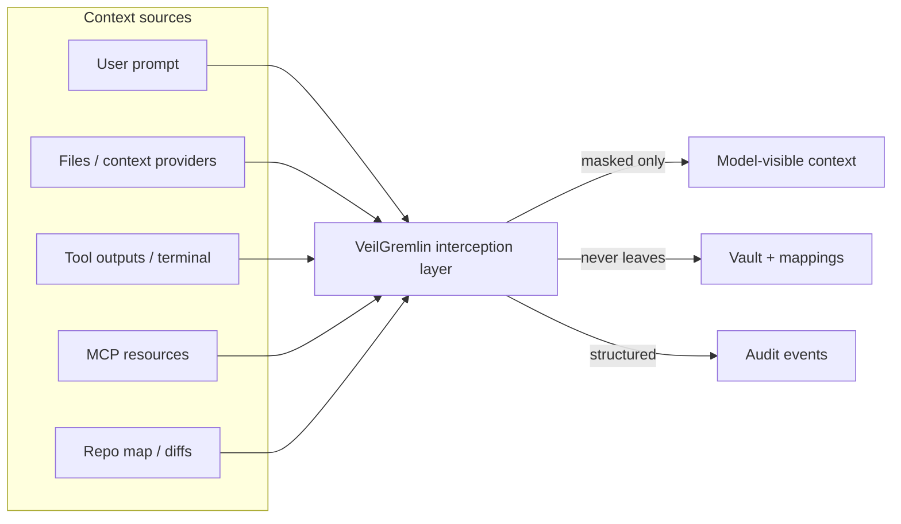
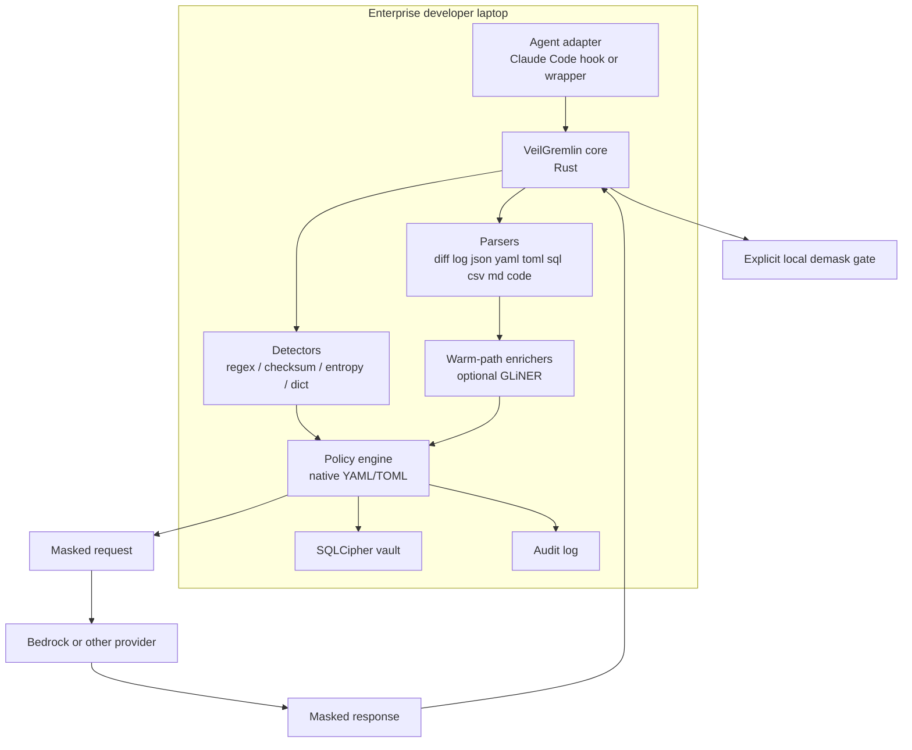
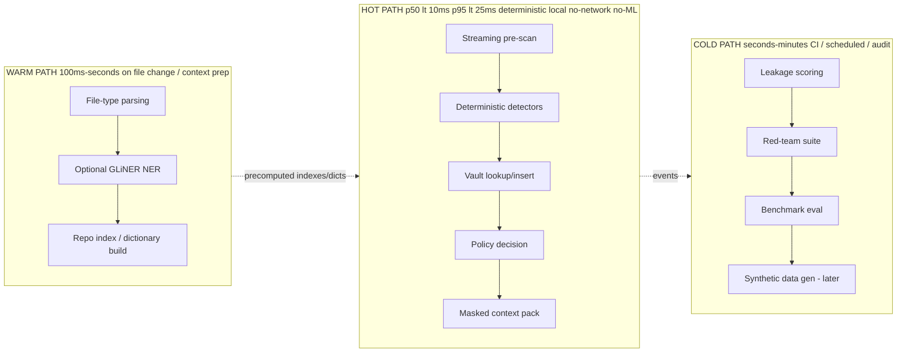
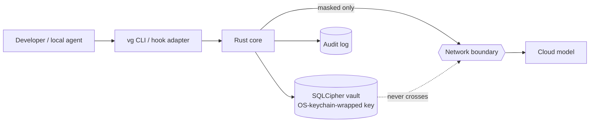
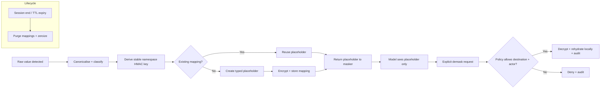
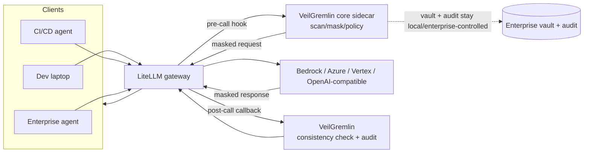
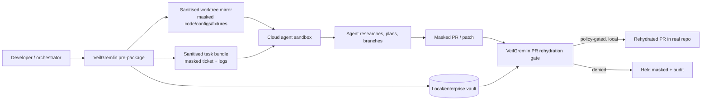

# VeilGremlin Requirements and Design Specification

**Project:** VeilGremlin — local-first privacy shield for agentic engineering
**Owner:** dermdunc · **Architect:** The Agentic Tekton
**Status:** Phase 0 → Phase 1 design · **Date:** 2026-06-30
**Document scope:** Phase 0 (Discovery) and Phase 1 (Laptop-first MVP)

> **Positioning note (binding on all copy):** VeilGremlin is a **technical and governance control supporting data minimisation, privacy by design, auditability, and risk-based adoption**. It does **not** make any deployment "GDPR compliant" or "EU AI Act compliant." Reject any wording that implies otherwise.

> Source context: `docs/research/deep-research-report.md`. The build orchestration for teams of agents lives in `docs/architecture/agent-factory-plan.md`.

---

## Executive Summary

VeilGremlin is a **local-first privacy control plane** that sits *in front of* cloud model invocation on a developer's machine. It enforces one hard rule: **unless the model is local and explicitly approved, the model never receives real PII or sensitive enterprise identifiers.** It intercepts developer- and agent-supplied context, applies deterministic masking and reversible pseudonymisation **locally**, sends only masked context to the model, and performs **explicit, local, policy-gated, auditable** rehydration after the response returns.

The architecture is a **small, hardened Rust core** (scanning, masking, vault, policy, audit, benchmarks) wrapped by **thin adapters**. Phase 1 ships a single reference workflow — **Claude Code on Amazon Bedrock on a regulated enterprise laptop** — via a wrapper + hook interceptor, because the first value proof must run on laptops without waiting for a control-plane rollout. The hot path is deterministic, local, bounded, cache-aware, and treated like a low-latency trading system (no network, no LLM-based detection). Optional local ML/NER lives strictly in the warm path.

Supply-chain integrity is a first-class design concern: signed releases, SBOMs, reproducible builds, no telemetry by default. The same hardened core is designed to later expose itself through **LiteLLM gateway hooks, MCP adapters, CI/CD modes, and sanitised cloud-agent worktree workflows** without rewrites.

**The differentiator is not "another guardrail or DLP."** It is the *millisecond-sensitive, file-aware, reversible-pseudonymisation layer that lives in the hot path of every coding-agent turn* and keeps the reversal material local.

---

## Product Thesis

VeilGremlin is a **privacy-preserving context transformation engine for agentic software delivery workflows.** The problem is not "detect PII somewhere in the SDLC." It is to **constrain what enters model-visible context while preserving enough semantic structure for the model to remain useful** — stable references across a session, preserved entity relationships, usable patches, very low latency, forensic audit, and a guarantee that local demasking never re-exposes real values to remote models.

Three structural bets:

1. **Transform before transmission, not detect after.** Guardrails inspect content the provider has already received. VeilGremlin changes *what leaves the endpoint*.
2. **Reversibility is the product.** Anyone can redact. The hard, valuable thing is *stable, typed, locally-reversible pseudonymisation* that keeps the model effective and lets the developer rehydrate safely.
3. **A small trusted core beats a big platform.** Build the core; integrate the edges (guardrails, DLP, observability, gateways, KMS) as complements.

---

## Why This Matters Now

- **Agents pull far more than a chat box.** Continue passes `@File`, `@Code`, `@Git Diff`, `@Terminal`, debugger state; Cline reads/writes files and runs commands; Codex CLI inspects repos, attaches screenshots, uses MCP, launches cloud tasks; Claude Code hooks fire on prompts and *every* tool call; Cursor indexes the whole codebase. Context grows **iteratively through tooling**, not in one prompt.
- **Cloud-hosted agents move the boundary earlier.** Copilot-style cloud agents clone repos, research code, plan, branch, and open PRs in hosted sandboxes. A prompt-only control is too late once the raw repo is already in the sandbox.
- **Observability widens the blast radius.** Langfuse, Helicone, Phoenix capture prompts, traces, tool calls, retrieval, and outputs. Without a privacy-aware layer, they *replicate* the leak.
- **Provider retention varies by endpoint and feature.** Statefulness (stored completions, threads, abuse logs) differs across providers. The only robust enterprise default is to **minimise what leaves the endpoint in the first place.**

---

## Regulatory and Risk Context

*Not legal advice. This maps supervisory expectations to technical controls.*

| Anchor | What it asks | VeilGremlin control |
|---|---|---|
| GDPR/UK GDPR Art. 5 — data minimisation | Personal data adequate, relevant, limited to necessary | Pre-invocation masking; minimal masked context packs; deny-by-default for `.env`, prod extracts |
| Art. 25 — privacy by design & default | Appropriate technical/organisational measures | Local interception, typed placeholders, separated mapping storage |
| Art. 32 — security of processing | Names pseudonymisation & encryption | SQLCipher vault, OS-keychain-wrapped key, signed policy packs, controlled demask |
| DPIA (ICO) | Begin early, run alongside development | Phase 0 DPIA-support pack: data-flow diagrams, policy files, transformation logs, coverage reports |
| Human oversight / risk mgmt (NIST AI RMF, EU AI Act governance vocabulary) | Logging, documentation, human review for sensitive decisions | Explicit demask commands, break-glass, approval gates, structured audit |

**Two non-negotiable caveats baked into the design:**

1. **Pseudonymised data remains personal data.** Typed placeholders + vault mappings are a *risk-reduction measure*, not an anonymity claim. Re-identification via quasi-identifiers (rare timestamp/location/incident combinations) is a known residual risk (Phase 4 roadmap).
2. **Do not over-claim.** Public dual-track positioning: open-source *"a local-first privacy shield for vibe coding"*; enterprise *"a reference architecture and compensating control for regulated agentic engineering."* Never *"compliant by default."*

---

## Target Users and Personas

| Persona | Wants | Phase 1 hook |
|---|---|---|
| **Developer** | Fast, low-friction help without exposing real customer/employee data | CLI + Claude Code wrapper; sub-50ms overhead; local transparency |
| **Platform engineer** | A deployable control that works now and scales to gateways | Hook/wrapper now; adapter seams for LiteLLM/MCP later |
| **Privacy officer** | Minimisation, reversible-pseudonymisation controls, DPIA evidence | Audit pack, transformation logs, policy files |
| **Risk manager** | Clear boundaries, exception handling, measurable residual risk | Policy-as-code, block/summarise rules, benchmark report |
| **Security engineer** | Tight local controls, strong key handling, minimal exfiltration paths | Local vault, no telemetry, signed binaries, SBOM |
| **AI governance lead** | Auditable policies, logs, deployment narrative | Versioned policy/detector, structured events |
| **Enterprise architect** | Starts on laptops, scales to gateway/CI/cloud agents | Gateway-ready, cloud-agent-aware core |

---

## Primary Use Cases

**Phase 1 anchor:** A developer debugs a **production incident log** (customer names, emails, account IDs, postcodes, employee IDs, hostnames, stack traces) with **Claude Code on Bedrock**, and asks for root cause + a regression test.

Extensions (later phases, same core): repo analysis, PR review, issue triage, migration work, incident analysis, CI/CD agent runs, local IDE agent workflows, and — for cloud agents — **sanitised task bundles, sanitised repo mirrors, privacy-safe worktrees** generated *before the sandbox is provisioned*.

---

## Non-Goals

Phase 1 is **not**:

- A full enterprise DLP platform or data-estate discovery tool.
- A universal secret manager / KMS.
- A regulator-facing compliance guarantee.
- A semantic safety framework for all harmful-content categories.
- **Dependent on a cloud LLM to decide what is safe to send to a cloud LLM.**
- A replacement for provider guardrails/DLP — those remain **complementary** layers *after* VeilGremlin transforms content.
- A synthetic-data generator (deferred; Phase 1 uses typed placeholders).

---

## Threat Model

Four threat classes:

1. **Accidental disclosure** (highest likelihood / commercial priority). Developer pastes logs, stack traces, CSV rows, ticket text, config fragments containing real PII. Agents make this trivial.
2. **Agentic amplification.** Even a harmless prompt grows dangerous as the agent pulls terminal output, repo maps, diffs, MCP resources. *VeilGremlin exploits the same tool-call seams (Claude Code hooks) to transform before the model sees it.*
3. **Adversarial manipulation / prompt injection.** Indirect document attacks try to make the model *request the real values back*. Mitigation is structural: the remote model has **no authority** to retrieve vault originals; rehydration has its own independent local policy gate.
4. **Supply-chain & control-plane compromise.** A privacy binary that can be tampered with, leaks via telemetry, or carries malicious deps is worse than useless. Signed binaries, reproducible builds, SBOMs, provenance, offline install, signed policy packs are **trust prerequisites**, not hardening niceties.

**Trust boundaries:**

- *Model-visible context* — placeholders only.
- *Control material* — vault mappings + keys, never travel with the prompt.
- *User-visible rehydration* — local only, post-policy-check.
- *Audit material* — structured events, no raw values in plaintext logs.

**Optimise for bounded failure, not perfect detection.** Conservative handling of high-risk artefacts (`.env`, raw DB extracts, prod log bundles) over heroic recall.

---

## Agentic Coding Context Map

Local interception points (Phase 1 covers the bold ones):

1. **User-prompt submission** (`UserPromptSubmit` hook)
2. **File attachment / context-provider expansion**
3. **Pre-tool invocation** (`PreToolUse`)
4. **Post-tool output ingestion** (`PostToolUse`)
5. **Pre-model request assembly** (wrapper)

Cloud-hosted agents move the point earlier: **before the repo/task bundle is packaged** (Phase 3).



---

## Sensitive Data Taxonomy

Two overlapping taxonomies.

**Privacy taxonomy**
- *Direct identifiers:* names, emails, phone numbers, addresses, postcodes, employee IDs, customer IDs, national identifiers, payment identifiers, account references.
- *Indirect / quasi-identifiers:* timestamps, job titles, incident references, unusual locations, rare combinations.
- *Special-treatment free text:* support tickets, customer-impact notes.

**Enterprise sensitivity taxonomy**
- Secrets & credentials, internal hostnames, internal IPs, infra identifiers, ticket numbers, trace IDs, repo-specific IDs, confidential architecture details, business-sensitive labels.

**Handling classes** (drive policy):

| Class | Default action |
|---|---|
| `irreversible_redact` (passwords, private keys, access tokens) | One-way redact; **never** vault-stored for reversal |
| `mask` (PII + enterprise IDs) | Reversible typed placeholder via vault |
| `block` (`.env`, `*.pem`, prod CSV) | Block or summarise; do not mask-and-send |
| `pass` (non-sensitive) | Pass through unchanged |

---

## Hard Product Principles

1. Unless the model is local and explicitly approved, it **never** sees real PII.
2. Masking is **automatic**.
3. Demasking is **explicit, local, policy-gated, auditable**.
4. Guardrails are the **last** line of defence, not the masking strategy.
5. Performance is treated like a low-latency trading system — every millisecond counts.
6. The hot path is **deterministic, local, bounded, cache-aware, measured in milliseconds**.
7. Supply-chain risk is a **first-class** architectural concern.
8. Phase 1 starts on laptops, but the architecture is **gateway-ready and cloud-agent-aware**.
9. Works as both **open-source dev tool** and **enterprise reference architecture**.
10. **No GDPR / EU AI Act over-claiming.** Position as a supporting control.

---

## Design Principles

- **Minimise before transmission.**
- **Mask automatically; demask explicitly.**
- **Keep the hot path deterministic** — no network, no LLM, bounded matching.
- **Typed placeholders over "smart" synthetic substitutions in Phase 1.**
- **Policy-as-code** for explainability and exceptions.
- **Separate model-visible context from rehydration material.**
- **Default to local execution, no telemetry.**
- **Supply-chain integrity is part of the privacy control.**
- **Parse before you scan** (file-type-aware).
- **Fail conservatively on high-risk artefacts.**

Maps cleanly to GDPR Art. 5/25/32, ICO DPIA expectations, and NIST privacy-engineering objectives (predictability, manageability, disassociability).

---

## Phase 0 Discovery Deliverables

| Deliverable | Description | Acceptance |
|---|---|---|
| Threat model | The four classes + trust boundaries above, written up | Reviewed by security + privacy |
| Context/interception map | Per-tool seams, Phase 1 coverage | Validated against Claude Code hook docs |
| Sensitive-data taxonomy | Privacy + enterprise, with handling classes | Mapped to detector backlog |
| Regulatory control mapping | Table linking controls to GDPR/NIST/AI Act vocab | Privacy officer sign-off |
| Performance & latency budget | Hot/warm/cold targets (below) | Benchmark harness skeleton agreed |
| Risk narrative | "Compensating control" positioning, dual-track copy | No over-claiming language |
| DPIA-support pack template | Data-flow diagrams, policy template, evidence list | Usable by an enterprise DPO |
| Test corpus design | Seeded / FS / red-team layers | Corpus repo scaffolded |
| ADR set (initial) | Language, vault, detectors, integration, placeholders | Recorded in `docs/decisions.md` |

**Phase 0 exit:** all deliverables reviewed; Go/No-Go criteria agreed; Phase 1 backlog locked.

---

## Phase 1 MVP Scope

**In scope**
- Local CLI (`vg`) + Claude Code hook integration (wrapper + `UserPromptSubmit`/`PreToolUse`/`PostToolUse`).
- Bedrock reference path (masked request → Bedrock → masked response → local demask gate).
- Deterministic hot-path detectors: secrets, emails, phones, postcodes, customer & employee IDs, internal IPs, hostnames, configurable financial identifiers (IBAN/sort-code), checksum + entropy.
- File-aware parsing: source code, diffs, JSON/YAML/TOML, logs, stack traces, Markdown, SQL, CSV, `.env`.
- Encrypted local vault (SQLCipher) with session mappings + optional repo-scoped stability.
- Typed placeholders, reversible; irreversible redact for secrets.
- **Explicit** demask command with destination controls.
- Local audit log + CLI inspection.
- Benchmark harness + seeded corpus + leakage tests.
- Optional warm-path local NER (GLiNER) — off by default, behind policy.
- Signed release, SBOM, reproducible-build discipline, no telemetry.

**Out of scope** (Phase 2+): LiteLLM, MCP server mode, other agent adapters, CI/CD, enterprise vault/KMS, synthetic data, quasi-identifier scoring, screenshot OCR.

---

## Recommended Architecture

A **small hardened Rust core** + **thin adapters**.



**Crate map** (one responsibility each, narrow seams):
`vg-core` · `vg-detectors` · `vg-parsers` · `vg-vault` · `vg-policy` · `vg-audit` · `vg-bench` · `vg-cli` · `vg-adapters-claude`.

---

## Hot Path / Warm Path / Cold Path Design



| Path | Target | Allowed work | Forbidden |
|---|---|---|---|
| **Hot** | p50 < 10 ms, p95 < 25 ms (assembly); **e2e added overhead p95 < 50 ms** | regex/Aho-Corasick/checksum/entropy, vault lookups, policy eval | network, ML, heavy alloc |
| **Warm** | 100 ms – few s | parsing, GLiNER, index/dictionary build | blocking the agent turn |
| **Cold** | s – min | leakage scoring, red-team, benchmarks, synthetic data | being on the request path |

The warm path *feeds* the hot path (precomputed dictionaries/indexes) but never blocks it.

---

## Local-First Architecture

Everything that touches raw values runs **on the laptop**: detection, masking, vault, policy, audit, demask. No cloud calls in the hot path. No telemetry by default. The vault key is wrapped by the **OS keychain** (macOS Keychain / Windows DPAPI / Linux Secret Service); raw values never leave the device in plaintext; audit logs store references, not secrets.



---

## Claude Code on Bedrock Reference Flow

Use **federated AWS access to the model layer**, but put VeilGremlin **on the laptop in front of Claude Code** so Bedrock receives only masked context.

```mermaid
sequenceDiagram
    participant Dev as Developer
    participant CC as Claude Code
    participant VG as VeilGremlin (hook/wrapper)
    participant Vault as Local vault
    participant BR as Amazon Bedrock
    participant Claude as Claude on Bedrock

    Dev->>CC: "Debug this incident, propose a regression test"
    CC->>VG: Prompt + incident.log + tool results
    VG->>VG: Parse, detect, classify
    VG->>Vault: Store encrypted mappings (typed placeholders)
    VG->>VG: Block accidental .env; assemble masked pack
    VG->>BR: Masked context only
    BR->>Claude: Masked context
    Claude-->>BR: Masked patch + explanation + test
    BR-->>VG: Masked response
    VG->>VG: Validate placeholder consistency
    VG-->>CC: Masked response (shown to dev)
    Dev->>VG: vg demask --from result.patch --to local_patch
    VG->>Vault: Resolve permitted placeholders
    VG-->>Dev: Locally rehydrated patch + audit event
```

---

## Cloud Models Never See PII Rule

Enforced by construction, not by trust:

- **Destinations are policy-typed.** `bedrock`, `anthropic`, `openai` → `allow_masked_only: true`. Only `*_local` runtimes with an approved profile may receive real values.
- **The masked pack is the only thing serialized to the wire.** Raw values exist only in the vault; the request assembler has no path to them.
- **No model-initiated rehydration.** A model "asking for the real value" is structurally impossible — the model has no vault handle, and rehydration is a separate local, gated command.
- **Demask destination `remote_model_prompt` is `deny` by policy** and cannot be overridden in default profile.
- **Verified by the eval harness:** zero raw-PII-to-remote is a Go gate (zero tolerated).

---

## Reversible Pseudonymisation Design

- **Typed placeholders, stable within a namespace.** Shapes: `CUSTOMER_NAME_001`, `EMAIL_003`, `ACCOUNT_ID_014`, `HOSTNAME_PROD_002`, `TRACE_ID_011`.
- **Stable key** = salted **HMAC over canonicalised(original ⧺ entity_type ⧺ namespace)**. Same value → same placeholder within the namespace (referential consistency preserved for the model).
- **Displayed ordinal** is sequential per type for readability; the cryptographic link lives in the vault. The ordinal leaks nothing about the original's structure.
- **Namespaces:** session (mandatory), repo (optional, Phase 1), user/org (enterprise, later).
- **Why placeholders, not synthetic values, in Phase 1:** obvious to the model, preserve referential consistency, avoid fake-but-plausible data that confuses debugging, trivially auditable ("the model saw `EMAIL_001` or it didn't"), easy to explain to privacy/risk. Synthetic/format-preserving values are a Phase 4 feature for fixtures/sandboxes only.

---

## Token Vault Design

- **Storage:** SQLite + **SQLCipher** (transparent AES-256), cross-platform, indexed lookups, session expiry, auditable demask events. Beats encrypted flat files because we need normalisation, lookups, TTL, and audit.
- **Key handling:** DB key wrapped by OS keychain; never persisted in plaintext; in-memory zeroized after use (`zeroize` crate).
- **Schema (core):** `mapping(id, namespace, entity_type, placeholder, hmac_key, ciphertext_value, created_at, last_used_at, ttl, source_artefact_ref)`; `demask_event(id, mapping_id, actor, destination, decision, policy_version, ts)`.
- **Irreversible class** (passwords/keys/tokens) is **never stored for reversal** — redacted one-way; only a redaction marker + hash-for-dedup is kept.
- **Enterprise growth path (later):** swap the local vault behind a narrow trait for a KMS/HSM-backed envelope-encryption backend (AWS KMS/CloudHSM, Azure Managed HSM, GCP KMS), role-based rehydration, break-glass, TTL/deletion controls — without touching the core API.



---

## Demasking and Rehydration Design

**Explicit, local, policy-gated, auditable — by default.**

- **No automatic rehydration** in the agent loop. The agent and the developer see masked output until an explicit `vg demask` command runs.
- **Destination-typed:** allowed targets are local artefacts (`local_patch`, `local_test_fixture`, `local_explanation_buffer`). `remote_model_prompt` and `observability_sink` are `deny`.
- **Actor + role gated** (developer/platform in Phase 1; richer RBAC later).
- **Placeholder-consistency validation** before rehydration: confirm the model preserved placeholders and didn't invent/merge them; flag drift.
- **Every demask is an audit event** (actor, destination, mapping refs, decision, policy version).

---

## Policy-as-Code Model

Phase 1: a **small native YAML/TOML policy** interpreted directly by the Rust core (low dependency, easy review). Three layers: **global defaults → repo profile → session overrides.** Governs artefact classes, entity classes, destinations, demask permissions, exception scopes, audit verbosity.

Later: **Cedar-backed** enterprise authorisation for rehydration/break-glass/RBAC (strong Rust fit); optional **OPA/Rego** federation for OPA-standardised shops. Neither is a Phase 1 dependency.

See `config/policy.example.yaml` in the build (and "Config File Examples" below).

---

## Audit Evidence Model

Every event is structured, local, append-only, and **contains no raw values** (only placeholder + mapping refs).

**Record types:** scan event · policy decision · mapping-reference creation · block event · demask request · demask approval/denial · provider destination · latency measurement · detector version · policy version · build-provenance version.

**Enterprise additions (later):** identity attributes, team/repo risk profile, exception-workflow IDs, SIEM export formats.

Feeds privacy, model-risk, and architecture reviews, and the DPIA-support pack.

---

## Detector Strategy

**Hybrid, deterministic-first:**

1. **Fast pre-scan (hot):** `.env`/PEM/JWT shapes, high-entropy strings, email/phone/IP shapes, IBAN/SWIFT/sort-code, HR/customer ID formats. Bounded matching (RE2-style), Aho-Corasick for dictionaries, tries, **checksum validation** for structured identifiers (IBAN mod-97, Luhn).
2. **Deterministic detection (hot):** custom regex, deny lists, org dictionaries, checksum validators, secret detectors, allow lists, proximity rules.
3. **Selective ML/NER (warm, optional, policy-gated):** **GLiNER** (lightweight, CPU-friendly, zero-shot) on NL-heavy content only — tickets, incident reports, support text, unstructured logs. Never the only gate; never on the hot path.

Borrow ideas (not the runtime) from Presidio (deny-list/regex recognisers), Gitleaks/TruffleHog (secret patterns + entropy + live-validation concept). Secret scanning alone is insufficient — it misses names, addresses, account IDs, HR refs, quasi-identifiers.

---

## File-Type-Aware Scanning Strategy

**Parse before you scan.** Use **tree-sitter** for code/diff (incremental, fast, error-tolerant, runtime-dependency-free); format-specific parsers for JSON/YAML/TOML/SQL/CSV/Markdown/logs.

| Artefact | Strategy |
|---|---|
| **Source code** | Mask string literals, comments, fixtures, test data, embedded config. Preserve syntax — don't touch identifiers/control flow unless a secret is literally encoded in a name. |
| **JSON/YAML/TOML/K8s/Terraform/CFN** | Keys are strong signals: `email`, `ssn`, `customer_name`, `apiKey`, `authorization` → typed handling. Rule-pack heavy. |
| **Logs / stack traces** | Parse KV + JSON fragments; mask IPs, usernames, hostnames, trace IDs, paths; **preserve shape and causality** (debugging needs sequence/correlation, not identity). |
| **SQL / CSV / parquet text** | Column-aware: infer sensitivity from headers + types. Multi-row extracts above threshold → **block or summarise**. |
| **Tickets / issues / MD / runbooks** | Hybrid: deterministic first, then selective GLiNER for names/addresses/titles. |
| **`.env` / secret-bearing files** | **Don't be clever — block by default;** offer a sanctioned synthetic/summarised representation. |

---

## Performance and Latency Budget

| Path | p50 | p95 | Constraints |
|---|---|---|---|
| Hot (assembly, moderate working set) | < 10 ms | < 25 ms | streaming, allocation-aware, cached, dictionary-backed, deterministic; **no network, no ML** |
| **End-to-end added overhead per invocation** | — | **< 50 ms** (target laptop profile) | this is the developer-felt number |
| Warm | — | hundreds of ms – few s | parsing, GLiNER, indexes |
| Cold | — | s – min | leakage scoring, red-team, benchmarks |

Engineering tactics: arena/bump allocation on the hot path, `bytes`-based zero-copy slicing, compiled regex sets reused across calls, Aho-Corasick automaton built once at load, vault prepared-statement reuse, per-session in-memory placeholder cache, criterion-based microbenchmarks gated in CI (regression budget).

---

## Supply Chain Threat Model

First-class. If the binary can be tampered with, the whole trust model collapses.

- **Minimal, pinned/vendored dependencies**; `cargo-deny` + `cargo-audit` in CI; dependency review on every bump.
- **Signed releases** (Sigstore/Cosign) + **SBOM** (CycloneDX/`cargo-cyclonedx`) attached to every artefact.
- **Reproducible builds** (pinned toolchain, `--locked`, deterministic flags) with an independently verifiable source→binary path.
- **Build provenance** (SLSA-style attestation) recorded; provenance version appears in audit logs.
- **Offline install** supported; **auto-update optional** and secured with TUF-style signed metadata + artefact verification.
- **Signed policy packs** — policies are code and must be verified before load.
- **No telemetry by default.** Any future opt-in telemetry must itself be masked and explicit.

---

## Recommended Technology Stack

| Layer | Choice | Why |
|---|---|---|
| Core | **Rust** | Memory/thread safety, no GC, performance, small trusted core, enterprise reviewability (Codex CLI itself is Rust "for speed and efficiency") |
| Vault | **SQLite + SQLCipher**, OS-keychain-wrapped key | Encrypted, local, queryable, cross-platform |
| Parsing | **tree-sitter** + format parsers | Incremental, error-tolerant, dependency-free at runtime |
| Detectors | Rust `regex`, Aho-Corasick, checksum/entropy, tries/dicts | Bounded, deterministic, fast |
| Warm NER | **GLiNER** first; Presidio optional; spaCy selective | CPU-friendly, zero-shot |
| Adapters | Thin Python/Node where ecosystem demands | Keep core pure |
| Policy | Native YAML/TOML now; Cedar later; OPA optional | Low dep now, strong auth later |
| Signing/provenance | Sigstore/Cosign, CycloneDX SBOM, reproducible builds | Trust prerequisite |
| Gateway (later) | LiteLLM sidecar/plugin calling the core | Provider-independent, hardened small core preserved |

---

## Build-vs-Buy Analysis

**Build the core, integrate the edges.** Enterprises can *buy* guardrails (Bedrock/Azure/Model Armor), DLP/discovery (Macie, Google SDP), observability (Langfuse/Helicone/Phoenix), KMS/HSM, and gateways (LiteLLM). They **cannot** readily buy one tool doing all of: millisecond endpoint interception + file-aware masking + stable reversible pseudonymisation + session placeholder consistency + local-only demask + developer-friendly CLI + later gateway/cloud-agent extension.

| Capability | Build | Buy/integrate |
|---|---|---|
| Hot-path detection/masking | ✅ core | — |
| Reversible local vault | ✅ core | KMS/HSM backend later |
| Policy engine | ✅ native now | Cedar/OPA later |
| Guardrails (harmful content) | — | ✅ complementary, *after* masking |
| DLP/discovery | — | ✅ Macie/SDP later for assurance |
| Observability | — | ✅ must receive masked-only |
| Gateway | — | ✅ LiteLLM later |
| Signing/SBOM | — | ✅ Sigstore/Cosign/CycloneDX |

---

## LiteLLM Future Integration Path

LiteLLM already offers an OpenAI-compatible proxy, **pre-call hooks**, request modification/rejection, and callbacks — an ideal place to call the hardened VeilGremlin core *before* routing onward. VeilGremlin sits **alongside** LiteLLM (sidecar/plugin), never absorbed into a large Python gateway.



---

## Cloud-Hosted Agent Future Integration Path

For cloud agents the boundary moves **before the sandbox is provisioned**: produce **sanitised repo mirrors, sanitised task bundles, privacy-safe worktrees**, then **rehydrate the resulting PR locally**.



The agent never receives production PII because the mirror/bundle were masked *before* upload; reversal happens only locally at PR-rehydration time.

---

## Developer Experience

Adoption lives or dies on friction. Before anything leaves the device, the wrapper prints a **short pre-send summary**: files scanned, entities masked by type, artefacts blocked, estimated added latency. Developers can inspect the masked pack locally. This converts VeilGremlin from "mysterious enterprise blocker" into "trustworthy local shield."

Defaults: masking automatic and silent-but-summarised; demasking explicit; no surprise network calls; clear exit codes for hook integration (block vs transform vs pass).

---

## CLI UX

```bash
vg run -- claude "Debug this incident and propose a regression test"
vg inspect incident.log            # show what would be masked, no send
vg diff --masked                   # preview masked context pack
vg demask --from result.patch --to local_patch
vg demask --from result.patch --to local_test_fixture
vg audit last                      # last action's audit record
vg audit show <id>
vg benchmark hot-path              # latency/recall report
vg policy check                    # validate + show effective policy
vg vault status                    # session mappings, TTL, counts
```

Example pre-send summary:

```
VeilGremlin · masked 1 file (incident.log)
  PERSON x4  EMAIL x3  ACCOUNT_ID x7  POSTCODE x2  INTERNAL_IP x5  HOSTNAME x3
  blocked: .env (artefact policy: block)
  added latency: ~7ms (hot path)  ·  destination: bedrock (masked-only)
Proceed? sending masked context to Bedrock...
```

---

## Config File Examples

`config/policy.example.yaml` (global defaults):

```yaml
version: 1

defaults:
  remote_models:
    allow_real_pii: false
  demask:
    mode: explicit
    audit: true

detectors:
  hot_path: { regex: true, checksum: true, entropy: true, dictionaries: true }
  warm_path: { gliner: false, presidio: false }   # off by default in Phase 1

artefacts:
  block:        [".env", "*.pem", "*.p12", "prod-export-*.csv"]
  strict_mask:  ["*.log", "*.trace", "*.json", "*.yaml", "*.sql", "*.md"]
  parse_as:
    "*.tf": terraform
    "*.yml": yaml
    "*.yaml": yaml
    "*.sql": sql
    "*.diff": gitdiff

entities:
  mask:
    [PERSON, EMAIL, PHONE, ADDRESS, POSTCODE, EMPLOYEE_ID, CUSTOMER_ID,
     ACCOUNT_ID, IBAN, SORT_CODE, INTERNAL_IP, HOSTNAME, API_KEY]
  irreversible_redact:
    [PASSWORD, PRIVATE_KEY, SECRET, ACCESS_TOKEN]

destinations:
  bedrock:      { allow_masked_only: true }
  anthropic:    { allow_masked_only: true }
  openai:       { allow_masked_only: true }
  ollama_local: { allow_real_pii_if_profile_approved: true }

demask_rules:
  allow:
    - { destination: local_patch,        roles: [developer] }
    - { destination: local_test_fixture, roles: [developer, platform] }
  deny:
    - { destination: remote_model_prompt }
    - { destination: observability_sink }
```

`.veilgremlin/repo.yaml` (repo profile override):

```yaml
version: 1
extends: global
namespace:
  repo_scoped_stability: true        # stable placeholders across the repo
artefacts:
  block: ["fixtures/real-customers-*.csv"]
detectors:
  warm_path: { gliner: true }        # NL-heavy ticket repo: enable NER
```

---

## Example Demo Scenario

A developer has `incident.log` with customer names, emails, account IDs, postcodes, employee IDs, service names, internal hostnames, and stack traces. They ask Claude Code (Bedrock) to find root cause + generate a regression test.

VeilGremlin intercepts prompt + log, masks customer/employee data into **stable typed placeholders**, **blocks** an accidentally-added `.env`, and sends **only masked context** to Bedrock. Claude returns a masked explanation, patch, and test. VeilGremlin shows the dev that the model saw only placeholders, validates placeholder consistency in the patch, and — after an explicit `vg demask --to local_patch` — rehydrates only permitted values locally. The audit report shows transformed artefacts, masked entity types/counts, provider destination, exact overhead, and **proof that no raw PII left the device.** *That* is the moment privacy and risk teams care about.

---

## Evaluation Harness

Tests **privacy outcomes** and **task utility**, locally.

**Privacy metrics:** detection precision/recall, FP/FN by entity type, placeholder consistency, irreversible-secret escape rate, quasi-identifier leakage score (basic in Phase 1), prompt-injection resistance.
**Utility metrics:** patch correctness, regression-test usefulness, root-cause accuracy, token overhead, e2e latency overhead, context-window inflation, developer-reported friction.
**Observability metrics:** verify downstream traces/gateways receive masked content only.
**Rehydration:** correctness + local auditability.

Harness lives in `vg-bench`; runs in the cold path; gates CI on regression budgets.

---

## Test Corpus Design

Layered:

1. **Seeded synthetic repo corpus** — multi-language code, configs, `.env` patterns, fixtures, incidents, tickets, logs, diffs with planted identifiers + secrets (ground-truth labelled).
2. **Financial-services corpus** — synthetic account refs, sort codes, IBAN-like values, incident notes, support tickets, postcodes, employee IDs.
3. **Red-team corpus** — prompt injection, obfuscation, odd formatting, base64 fragments, multi-line credentials, screenshot-to-text, partial identifiers, pasted SQL output, PII hidden in stack traces.
4. **Sanitised real enterprise corpus** (later, controlled) — calibration + FP tuning.

All synthetic data is generated/owned by the project — no real PII in the repo, ever.

---

## Failure Modes

| Failure | Effect | Mitigation |
|---|---|---|
| False negative | Raw value leaks | Conservative artefact blocking; layered detectors; red-team corpus; secret recall ≥99% gate |
| False positive | Utility/trust loss | FP budget <3% by reviewed findings; allow-lists; inspect command |
| Placeholder instability | Broken cross-turn reasoning | HMAC-stable keys; session cache; ≥99% consistency gate |
| Over-redaction | Task destroyed | Shape/causality preservation; column/threshold rules |
| Under-redaction (quasi-IDs) | Re-identification | Flag as residual risk; Phase 4 scoring |
| Wrong demask destination | Re-exposure | Destination-typed deny rules; `remote_model_prompt` hard-deny |
| Vault corruption | Lost reversibility | WAL + integrity checks; backup; graceful "masked-only" degrade |
| Prompt injection asking for originals | Attempted leak | Model has no vault handle; independent rehydration gate |
| Observability captures raw input | Leak via sink | Sinks placed *after* VeilGremlin; masked-only enforced |
| Supply-chain compromise | Mapping exfiltration | Signed builds, SBOM, reproducible builds, no telemetry |

---

## Risks and Mitigations

| Risk | Likelihood | Impact | Mitigation |
|---|---|---|---|
| Latency regresses past budget | Med | High (adoption) | criterion benchmarks gated in CI; arena alloc; compiled regex sets |
| Detector recall insufficient on NL | Med | High | warm-path GLiNER; layered detectors; corpus-driven tuning |
| Developers disable the tool (friction) | Med | High | pre-send summary; inspect/diff; <50ms overhead; sensible defaults |
| Over-claiming triggers compliance backlash | Low | High | strict positioning copy; legal review of public text |
| Hook API changes in Claude Code | Med | Med | thin adapter, versioned; wrapper fallback |
| Vault key mishandling | Low | Critical | OS keychain wrap; `zeroize`; never plaintext at rest |
| Scope creep into full DLP | Med | Med | Non-goals enforced; "build core, integrate edges" |

---

## Architecture Decision Records

| ADR | Decision | Recommendation | Reason |
|---|---|---|---|
| ADR-001 | Core language | **Rust** | Memory/thread safety, no GC, small trusted core, enterprise reviewability |
| ADR-002 | Local vault | **SQLCipher SQLite** | Encrypted, local, queryable, cross-platform, supports normalisation/TTL/audit |
| ADR-003 | Detector mix | **Deterministic hot path + optional GLiNER warm path** | Latency + explainability + recall balance |
| ADR-004 | First integration | **Claude Code wrapper + hooks on Bedrock** | Fastest enterprise proof, no central platform dependency |
| ADR-005 | Masking strategy | **Typed placeholders, not synthetic values** | Transparent, stable, auditable, debug-safe |
| ADR-006 | Demasking | **Explicit, local, policy-gated** | Prevents re-exposure; supports oversight |
| ADR-007 | Policy engine | **Native YAML/TOML now; Cedar later** | Low dependency now; strong auth later |
| ADR-008 | Gateway strategy | **LiteLLM later, core stays separate** | Hardened small core + provider-independence |
| ADR-009 | Supply chain | **Sign + SBOM + reproducible builds + no telemetry** | Trust prerequisite for a privacy binary |
| ADR-010 | Placeholder key | **Salted HMAC over canonicalised value+type+namespace** | Stable consistency without leaking structure |

---

## Phase 1 Backlog

| Priority | Item | Outcome |
|---|---|---|
| High | Rust core scanner + masker | Deterministic hot path |
| High | SQLCipher vault + key wrapping | Reversible pseudonymisation |
| High | Claude Code adapter (hook + wrapper) | First reference workflow |
| High | File parsers: logs, diffs, JSON/YAML/TOML, SQL, CSV, `.env`, code | Context-aware masking |
| High | Detector packs: secrets, core PII, enterprise IDs | Immediate coverage |
| High | Audit log schema + CLI inspection | Evidence and trust |
| High | Benchmark harness + seeded corpus | Measurable efficacy |
| High | Policy engine (YAML/TOML, 3-layer) | Explainable control |
| Medium | GLiNER warm-path enrichment | Better recall on tickets/incidents |
| Medium | Masked context-pack viewer (`vg diff --masked`) | Developer transparency |
| Medium | Demask destination controls | Safer local workflows |
| Medium | Signature verification + SBOM pipeline | Supply-chain assurance |
| Later | LiteLLM adapter · MCP mode · CI/CD · enterprise vault | Phase 2/3 |

---

## Repository Structure

```text
veilgremlin/                 # (this repo — Hekton factory-output)
  crates/
    vg-core/                 # orchestration, masking pipeline, library API
    vg-cli/                  # vg binary
    vg-policy/               # native YAML/TOML policy engine
    vg-vault/                # SQLCipher vault + key wrapping
    vg-detectors/            # regex/checksum/entropy/dictionaries
    vg-parsers/              # tree-sitter + format parsers
    vg-audit/                # structured audit log
    vg-bench/                # benchmark + eval harness
    vg-adapters-claude/      # Claude Code hook + wrapper
  adapters/python/ adapters/node/
  policies/default/ policies/financial-services/
  corpus/seeded/ corpus/synthetic/ corpus/red-team/
  docs/architecture/ docs/spec/ docs/research/ docs/threat-model/ docs/dpia-pack/
  examples/phase1-incident-demo/
```

(The repo also carries the Hekton control-plane files: `.hekton/`, `docs/decisions.md`, `docs/next-actions.md`, `docs/session-log.md`, etc.)

---

## Documentation Structure

Installation guide · Quickstart · Architecture overview · Threat model · Policy reference · CLI reference · Phase 1 demo walkthrough · DPIA-support pack template · Benchmark methodology · Release-signing & verification guide · Enterprise deployment preview · ADR index.

---

## Open Questions

1. **Multilingual / domain entity coverage** — Comprehend/spaCy language limits; deliberate later investment.
2. **Quasi-identifier leakage** — Phase 1 cuts direct identifiers sharply but won't fully solve rare-incident re-identification (Phase 4 scoring).
3. **Screenshot ingestion** — if OCR'd locally, the OCR stage joins the privacy boundary and must be benchmarked for leakage/error.
4. **Graph-based context preservation** — promising for customer→account→log-event relationships; not required for MVP.
5. **Enterprise policy language** — native now; exact Cedar/OPA strategy waits for control-plane work.
6. **Repo-scoped vs session-scoped default stability** — UX vs leakage trade-off to validate with the demo.

---

## Go/No-Go Criteria

| Criterion | Go threshold |
|---|---|
| Raw PII sent to remote model in seeded tests | **Zero** tolerated |
| Placeholder consistency across a single task | ≥ 99% |
| Hot-path p95 overhead on target laptop profile | < 50 ms |
| Secret detection recall (core classes) on seeded corpus | ≥ 99% |
| PII recall on core seeded classes | ≥ 95% |
| False-positive rate on representative engineering corpus | < 3% by reviewed findings |
| Reproduce demo patch locally after demask | Yes |
| Audit pack quality for privacy/risk review | Pass |
| Signed binary + SBOM + provenance + offline install | Pass |

---

## First 10 Implementation Tasks

These map to the work streams in `docs/architecture/agent-factory-plan.md` and the task IDs in `docs/architecture/work-breakdown.md`.

1. **Scaffold the Cargo workspace** with the crate map. Wire CI with `cargo-deny`, `cargo-audit`, `--locked`, pinned toolchain. *(supply chain from commit #1)*
2. **Define the core library API + types** in `vg-core`: `scan`, `mask`, `rehydrate`, `benchmark`; `Finding`, `EntityType`, `HandlingClass`, `Namespace`, `MaskedPack`, `AuditEvent`. Freeze these signatures early.
3. **Implement deterministic hot-path detectors** in `vg-detectors`: compiled regex sets, Luhn + mod-97 checksums, entropy detector, Aho-Corasick dictionaries. Criterion benches assert p95 < 25 ms.
4. **Build typed-placeholder + HMAC keying**: canonicalisation, salted HMAC over `(value, type, namespace)`, per-type ordinals, session cache.
5. **Implement the SQLCipher vault** in `vg-vault`: schema, OS-keychain key wrapping (macOS first), `zeroize`, TTL/purge, prepared-statement reuse.
6. **Implement the native policy engine** in `vg-policy`: 3-layer load, artefact/entity/destination/demask rules, signed-pack verification stub, `vg policy check`.
7. **Implement the masking pipeline** in `vg-core` tying detectors → policy → vault → masked pack, including `.env`/block and irreversible-redact paths.
8. **Implement file-aware parsing** in `vg-parsers`: logs, git diffs, JSON/YAML, `.env`, tree-sitter for one language first.
9. **Build the Claude Code adapter** in `vg-adapters-claude`: hooks + `vg run --` wrapper, masked-request assembly to Bedrock, pre-send summary, masked-response passthrough, explicit `vg demask` gate.
10. **Stand up the benchmark + seeded corpus** in `vg-bench` and `corpus/seeded`: planted ground truth, incident-log demo fixture, Go/No-Go report (recall, FP, consistency, latency, zero-raw-PII assertion).
